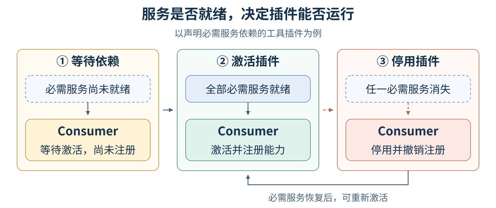
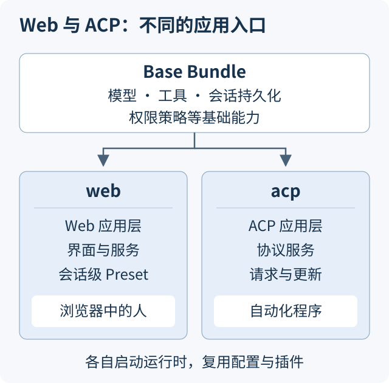
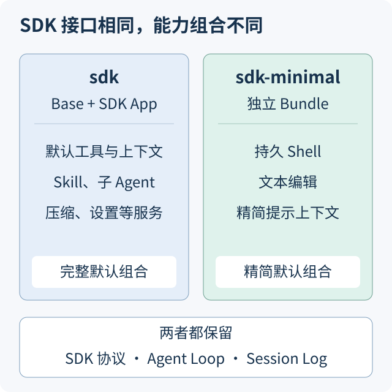
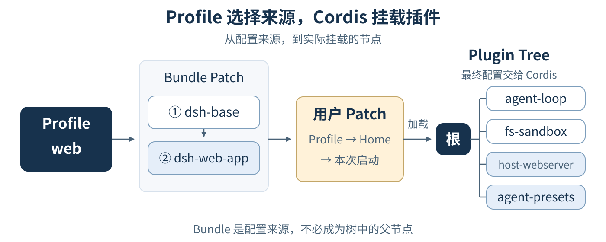
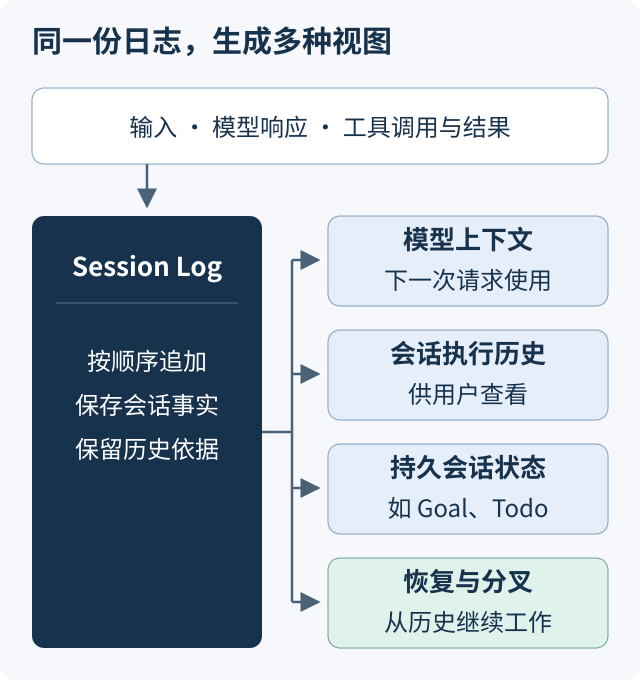

# DeepSeek Harness 有什么不同：从插件组合到会话恢复

## 概述

用过 Claude Code 的人，对 Agent 的工作方式并不陌生：提出任务，模型读取文件、调用工具、观察结果，然后继续工作。这背后负责组织模型请求、工具执行和会话状态的软件，就是 Harness。DeepSeek Harness（简称 DSH）把这些机制都纳入插件体系，让开发者能够替换运行机制、组合应用形态，并从持久记录中延续会话。理解它的特点，可以沿着三个概念展开：Cordis、Everything is a plugin，以及 Session Log。

## 目录

- [DSH 把什么交给了开发者](#what-is-open)
- [Cordis：让插件能够协作和替换](#cordis)
- [Everything is a plugin：组合决定应用的样子](#plugin-composition)
- [Session Log：从记录生成上下文和状态](#session-log)
- [什么时候这些差异有价值](#when-it-matters)
- [延伸阅读](#further-reading)

---

## DSH 把什么交给了开发者

假设你想定制一个 Coding Agent。增加一项 Skill、接入一个外部工具、在执行命令前做检查，都是常见需求。再往下一层，你可能还想改变工具的执行方式，替换会话存储，甚至使用自己的 Agent Loop，决定模型何时继续请求、何时停止。

这些需求涉及不同程度的控制权。Claude Code 的公开插件机制提供 Skills、子 Agent、Hooks、MCP 等扩展，适合把知识、工具和工作流程接入已有产品。DSH 的插件范围进一步覆盖运行机制：模型适配、工具注册与执行、会话服务、Agent Loop，以及 Web 界面，都可以通过插件组合来选择和替换。这里比较的是公开提供给开发者的扩展方式。[Claude Code 插件文档](https://code.claude.com/docs/en/plugins)、[DSH 架构说明](../docs/architecture.md#cordis)

因此，理解 DSH 时，值得问的是三个具体问题：我能改变 Agent 的哪些运行机制？我能用这些能力组合出什么应用？一次工作中发生的事情，又如何成为下一次继续工作的依据？

---

## Cordis：让插件能够协作和替换

DSH 使用 Cordis 管理插件。把 Cordis 理解为负责插件协作和生命周期的框架，就足以读懂后面的内容。它最关键的作用有两个：让插件找到需要的能力，以及让插件退出时撤销自己注册的东西。

### 插件通过能力协作

一个工具需要读文件，可以依赖文件服务；需要调用模型，可以依赖模型服务。Cordis 负责把需要服务的插件与提供服务的插件连接起来。插件之间也可以通过事件协作，例如在工具执行前做权限检查，在模型请求前加入上下文。

这让开发者有两种改造方式。希望调整某个环节时，可以在已有扩展点加入插件；希望改变整套机制时，可以提供满足相应接口的替代实现。Agent Loop 本身也是插件，所以开发者能够拥有它的实现，而工具或策略插件也有各自的扩展位置。[Cordis 入门](../docs/cordis-primer.zh.md)、[DSH 扩展位置](../docs/architecture.md#where-new-behavior-goes)

### 插件可以加载，也可以退出

插件运行时会注册工具、服务或事件监听器。Cordis 将这些注册与插件实例的生命周期关联起来：卸载插件时，相应注册也被撤销；依赖某项服务的插件，则随服务的可用性激活或退出。这样，调整插件组合才有明确的生效和清理机制。

图 1：以工具为例，插件的生命周期包括它对运行时产生的注册效果。

这也是“运行时重组”的基础。但需要区分框架能力和应用默认行为：当前内置 Web Profile 支持配置热重载，ACP、SDK、SDK Minimal 等 Profile 在启动时应用配置；插件代码的模块热更新需要另行启用。热重载也不等于任意组件升级都能保留正在进行的工作。[Profile 加载策略](../docs/architecture.md#profiles-and-bundles)

---

## Everything is a plugin：组合决定应用的样子

Everything is a plugin 的含义，可以从实际产品看出来：DSH 的运行能力由插件提供，插件的选择和组织共同决定应用的行为。同一套基础能力可以用于浏览器交互，也可以通过协议交给其他程序调用；Agent 的工具和上下文也可以按需求组合。

### Plugin Tree 代表什么

Plugin Tree 描述一次运行中挂载了哪些插件，以及它们的父子关系。树中的节点对应插件挂载，子树提供一种组织和管理插件的方式。树边表示挂载关系；服务依赖和执行时的调用关系需要分别理解。

与插件树一起工作的还有 Context，它决定插件在当前位置能看到哪些服务。公共服务可以被复用，需要独立的服务则可以隔离。在 Web 应用里，这让共享的运行基础设施和每个会话各自装配的 Agent 能力能够同时存在。

对使用者来说，插件树回答了一个很实际的问题：当前应用拥有的这些能力，分别是由什么组合出来的？下面两组对比能把这个问题讲得更具体。

### Web 与 ACP：把能力提供给不同的使用者

Web 面向浏览器中的人：用户查看会话、输入消息、选择模型、管理设置，并通过界面与 Agent 交互。它在公共基础上增加 Web 服务和界面相关插件，还通过 Preset 为每个会话装配 Agent 能力。

ACP 是 Agent Client Protocol。DSH 的 ACP Profile 提供面向自动化程序的协议入口：调用方通过标准协议创建会话、提交任务、接收更新，并管理会话生命周期。它与 Web 复用 Base Bundle 中的模型、工具、持久化等基础能力，同时拥有自己的协议服务和启动方式。[Web Bundle](../packages/bundle/web-app/README.md)、[ACP Bundle](../packages/bundle/acp-app/README.md)

图 2：同一份基础组合可以被不同应用复用。两种 Profile 启动的是各自的运行时。

这说明插件化能够决定整个应用的交互方式。开发者既可以为人组合一个交互产品，也可以把 Agent 能力交给另一个程序使用。

### SDK 与 SDK Minimal：选择 Agent 拥有的能力

另一组对比发生在同一种程序调用方式之内。SDK 客户端通过协议驱动 DSH；它启动哪一种 Profile，决定背后运行的是哪套能力组合。

`sdk` 使用 Base Bundle 加 SDK 应用层，提供默认工具和配套服务。`sdk-minimal` 使用独立 Bundle，显式列出所需插件：它保留模型调用、Agent Loop、会话持久化和 SDK 协议，默认向模型提供两种工具——持久 Shell 与文本编辑。Shell 在 Linux、macOS 上使用 Bash，在 Windows 上使用 PowerShell。

Minimal 的默认组合没有 Skill 工具、子 Agent 和上下文压缩等能力，也省去了完整 Profile 中的多项上下文贡献。因此，模型接收到的工具与提示内容也随组合改变。这种差异既影响开发者接入了哪些功能，也影响模型实际如何工作。[SDK Bundle](../packages/bundle/sdk-app/README.md)、[SDK Minimal Bundle](../packages/bundle/sdk-minimal/README.md)

图 3：同样通过 SDK 调用，背后的 Agent 仍可以采用不同的能力组合。

Minimal 也有相应的使用条件：它默认采用完整访问权限，适合放在由调用方隔离好的运行环境中。选择组合时，功能和权限策略需要一起考虑。

### 插件树是怎样组合出来的

这里用四个概念就能串起来：Plugin 提供具体能力；Bundle 把一组插件配置组织成可复用的分发单元；Profile 选择这次启动要使用哪些 Bundle；Patch 用于调整配置、启停插件或加入新的插件。

组合从空配置开始，先按 Profile 指定的顺序应用 Bundle，再依次应用 Profile 自己的 Patch、Harness Home 中的 Patch，以及本次启动额外指定的 Patch。后面的层可以覆盖前面的选择。最终配置交给 Cordis，形成运行中的插件树。

图 4：Profile 决定应用如何组合，Patch 让复用的组合仍然可以调整。树中的节点按能力类别示意。

Web 中还会出现 Preset：Profile 负责这次启动的应用，而 Preset 负责一个会话中的 Agent 能力，例如工具、提示词和 Skill。于是，“整个应用提供什么基础设施”和“这个会话使用哪些能力”可以分别选择。[Profile 与 Bundle](../docs/architecture.md#profiles-and-bundles)、[Agent Presets](../packages/preset/agent-presets/README.md)

---

## Session Log：从记录生成上下文和状态

插件组合回答“这个 Agent 拥有什么”，Session Log 则回答“这个会话发生过什么”。在 DSH 中，Session Log 是持续追加的会话事件序列，记录用户输入、模型响应、工具调用与结果，以及需要保存的会话状态。

### 模型看到的内容，必须能够从日志重建

假设 Agent 读取了一个文件，随后根据文件内容回答问题。模型下一轮请求所使用的对话历史，应当能够根据日志中的输入、工具调用和结果重新生成。额外注入的模型可见上下文，同样需要有日志依据。

DSH 把“模型可见内容必须能够从日志重建”作为明确的架构规则。日志因此同时参与运行和展示：模型历史、用户查看的执行过程，以及由事件记录的 Goal、Todo 等状态，可以从同一条事件流生成各自的视图。[Session Log 架构规则](../docs/architecture.md#session-log)

图 5：同一份会话事实，可以服务于模型、用户界面和后续会话操作。

这些视图不必包含完全相同的内容。例如，上下文压缩会改变下一次模型请求使用的历史，但已经发生的会话事实仍保留在日志里。用户可查看的历史与模型当前使用的上下文，可以有各自的呈现方式。

### 恢复会话时，恢复的是什么

一个进程退出后，新进程可以读取已保存的日志，重建会话历史和相关状态，再把新的输入、模型响应和工具结果追加下去。分叉则从选定的历史位置开始形成另一条会话。原有记录成为继续工作的依据。[Session 子系统](../docs/subsystems/session.zh.md)

这里的恢复有明确范围：日志保存的是会话事实。工作区文件可能已经变化，旧的 Shell 进程可能已经结束，外部服务也可能返回不同结果。恢复会话不代表把整个运行环境还原到过去，更不保证模型再次执行时产生完全相同的答案。

### DSH 与 Claude Code 的会话能力

Claude Code 也会持久保存会话，并通过这些记录恢复对话历史、工具调用和结果；它的 SDK 也支持恢复和分叉。两者都能在已有对话的基础上继续工作。[Claude Code 会话管理](https://code.claude.com/docs/en/sessions)、[Claude Agent SDK 会话管理](https://code.claude.com/docs/en/agent-sdk/sessions)

DSH 向开发者开放了这套会话机制的组成和扩展方式：会话事件是模型上下文及多种产品视图的共同依据，开发者能够围绕这些事件增加持久状态和视图，也能替换持久化实现。例如，插件增加一项需要在恢复后保留的会话状态时，可以把变化写成事件，再从历史事件恢复相应状态。插件体系与 Session Log 在这里相连，让新增能力也能够参与会话的记录与延续。

---

## 什么时候这些差异有价值

如果目标是让 Agent 完成日常编码，实际效果仍需要结合模型、工具和任务来判断。本文讨论的架构选择，也不能直接推出某个 Agent 的编码能力更强。

当目标变成构建自己的 Agent 产品时，DSH 的这些能力就更容易体现价值：可以调整运行机制，选择完整或精简的能力组合，为浏览器或自动化程序提供不同入口，并让需要延续的会话事实进入统一记录。Cordis 管理插件如何协作与退出，插件组合决定应用和 Agent 的能力，Session Log 为上下文、状态及后续恢复提供依据。

DSH 当前处于开发者预览阶段。理解这套设计的意义，在于知道哪些部分可以由自己决定，以及每种选择会怎样影响实际运行。[项目状态](../README.md#developer-preview)

---

## 延伸阅读

- [DSH 架构说明](../docs/architecture.zh.md)：插件组合、运行过程和 Session Log 的完整关系。
- [Cordis 入门](../docs/cordis-primer.zh.md)：服务、事件、依赖和插件生命周期的基本机制。
- [SDK Minimal](../packages/bundle/sdk-minimal/README.md)：精简组合提供的工具及其使用条件。
- [Session 子系统](../docs/subsystems/session.zh.md)：会话事件、存储与恢复的进一步说明。

## 开发备注

无。