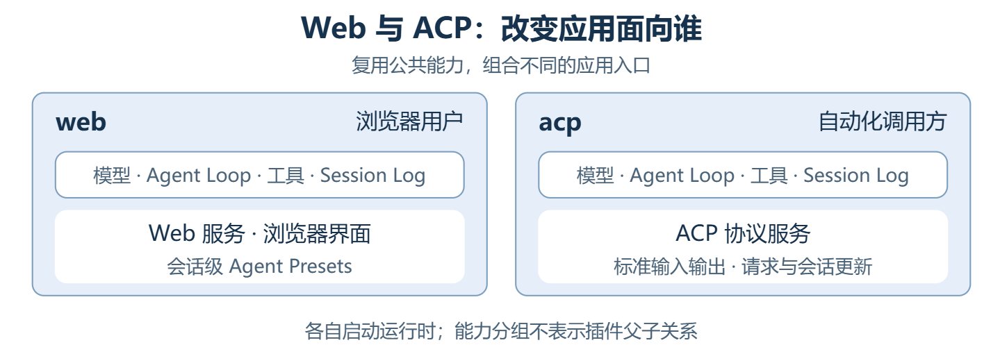

# DeepSeek Harness 有什么不同：从插件组合到会话恢复

用过 Claude Code 的人，对接入工具、添加 Skill 应该不陌生。比起继续增加能力，我更关心另一个问题：如果想替换 Agent Loop、模型接入或工具调用系统，是否必须直接修改原有实现？

DeepSeek Harness（简称 DSH）把这些运行机制本身也做成了插件。**开发者可以通过独立插件和配置组合，扩展 Agent 能力或替换运行组件，而不必直接修改原有实现。**

同一套 Harness 可以支撑不同的产品形态：DSH Web 面向浏览器中的用户，DSH ACP 面向自动化调用方，DSH SDK 让开发者把 Agent 能力接入自己的应用；独立社区项目 DSH Desktop 则复用 DSH 的 Web 界面、Host 服务和插件系统，增加原生窗口、托盘等桌面能力。[DSH 应用组合](../docs/architecture.md#profiles-and-bundles)、[DSH Desktop 项目说明](https://github.com/anywhere-labs/dsh-desktop)

*图 1：复用公共运行机制，组合不同能力与入口。连线表示复用与组合，不表示同一运行实例；Desktop 为第三方产品。*

本文沿着 Cordis、Everything is a plugin 和 Session Log 展开，结合界面、应用组合和会话恢复，理解 DSH 与 Claude Code 的差异。

## 目录

- [DSH 把什么交给了开发者](#dsh-%E6%8A%8A%E4%BB%80%E4%B9%88%E4%BA%A4%E7%BB%99%E4%BA%86%E5%BC%80%E5%8F%91%E8%80%85)
- [Cordis：让插件能够协作和替换](#cordis%E8%AE%A9%E6%8F%92%E4%BB%B6%E8%83%BD%E5%A4%9F%E5%8D%8F%E4%BD%9C%E5%92%8C%E6%9B%BF%E6%8D%A2)
- [Everything is a plugin：组合决定应用的样子](#everything-is-a-plugin%E7%BB%84%E5%90%88%E5%86%B3%E5%AE%9A%E5%BA%94%E7%94%A8%E7%9A%84%E6%A0%B7%E5%AD%90)
- [Session Log：从记录生成上下文和状态](#session-log%E4%BB%8E%E8%AE%B0%E5%BD%95%E7%94%9F%E6%88%90%E4%B8%8A%E4%B8%8B%E6%96%87%E5%92%8C%E7%8A%B6%E6%80%81)
- [一套 Harness，减少重复建设](#%E4%B8%80%E5%A5%97-harness%E5%87%8F%E5%B0%91%E9%87%8D%E5%A4%8D%E5%BB%BA%E8%AE%BE)
- [延伸阅读](#%E5%BB%B6%E4%BC%B8%E9%98%85%E8%AF%BB)

---

## DSH 把什么交给了开发者

可以从三个层次区分 Agent 的定制对象：

- Model：模型权重及其持久配置，决定模型本身具备的能力。
- Harness，也就是这里说的 Agent Runtime：组织模型请求、工具执行和会话状态的运行机制，包括 Agent Loop、LLM 适配、工具注册与调度等。
- Capability Assets：供 Agent 加载和使用的能力资产，例如 Prompt、Skill、工具描述、脚本和参考资料。

这三个层次用于区分定制对象，不表示执行顺序。脚本或插件属于哪一层，取决于其职责，而非文件形式。

*图 2：差异在于运行组件怎样被定制和替换，而不只是能添加多少工具或 Skill。*

Claude Code 的公开插件机制提供 Skills、子 Agent、Hooks、MCP 等扩展。这些扩展既能接入知识和工具，也能通过 Hooks 干预工具执行、影响是否继续工作。定制通过产品提供的扩展点完成；但公开插件机制并没有提供把内置 Agent Loop、LLM 适配或工具调用系统整体换成另一份实现的入口。[Claude Code 插件文档](https://code.claude.com/docs/en/plugins)、[Hooks 文档](https://code.claude.com/docs/en/hooks)

DSH 则把运行组件本身也纳入插件体系。想调整某个环节，可以使用已有扩展点；想替换组件的实现，可以编写符合相应接口的独立插件，再通过配置组合使用它。**这里的“非侵入式替换”，指的是不必直接修改原有组件的实现，不是不用写代码，也不是不受接口约束。** 模型适配、工具注册与执行、会话服务、Agent Loop，乃至 Web 界面，都参与这样的插件组合。[DSH 架构说明](../docs/architecture.md#cordis)

替换 LLM 适配器改变的是 Harness 接入模型的方式，不涉及模型权重；本文不比较模型本身的能力。

---

## Cordis：让插件能够协作和替换

把各项机制做成插件之后，还需要解决两个问题：插件怎样找到彼此提供的能力？替换或卸载一个插件时，它留下的注册又由谁清理？**DSH 使用 Cordis 来管理这些协作和生命周期。**

### 插件通过能力协作

**一个工具需要读文件，可以调用文件服务；需要调用模型，可以调用模型服务**。这里的 Service，是有名称和接口约定的能力。使用能力的插件是 Consumer，提供具体实现的插件是 Provider。Consumer 依赖的是服务，不必直接引用某个 Provider 的实现；只要替代实现满足相同的服务名称和接口约定，就不必跟着修改 Consumer 的代码。

**另一类需求，是让其他插件参与一个过程**。例如，在工具执行前做权限检查，在模型请求前加入上下文。这类协作可以通过 Event 完成：发起插件提供扩展点，监听插件按约定参与，发起方不必知道有哪些插件在监听。监听器能否修改结果、拦截后续执行，以及按什么顺序运行，都由具体事件的分发约定决定。

*图 3：Service 连接能力的使用者与提供者，Event 让其他插件参与已有过程。*

工具和策略有各自的扩展位置，并不是每次定制都需要改 Loop。[Cordis 入门](../docs/cordis-primer.zh.md)、[DSH 扩展位置](../docs/architecture.md#where-new-behavior-goes)

### 插件可以加载，也可以退出

Cordis 会等插件声明的全部必需服务就绪，再激活插件。Provider 已挂载并不表示服务就绪，服务可能仍需初始化。

这个依赖关系在运行期间仍然有效。任一必需服务消失，依赖它的插件会停用；必需服务恢复后，插件可以重新激活。Cordis 同时把工具、服务和事件监听器等注册与插件实例的生命周期关联起来，插件停用或卸载时，会撤销自身的这些注册。[服务依赖](../docs/cordis-tutorial/03-services.zh.md)、[生命周期与副作用](../docs/cordis-tutorial/02-lifecycle-and-effects.zh.md)

*图 4：服务依赖是持续的运行条件，注册效果随插件的激活与停用一同进入和退出。*

工具插件激活时注册工具，停用时撤销注册；Agent 下一次组装工具列表时，读取当时注册表里可用的工具。

当前内置 Web Profile 支持配置热重载，ACP、SDK、SDK Minimal 等 Profile 在启动时应用配置；插件代码的模块热更新需要另行启用。**配置热重载不等于任意组件都能无损升级**，正在进行的工作能否保留，还要看具体组件。[Profile 加载策略](../docs/architecture.md#profiles-and-bundles)

---

## Everything is a plugin：组合决定应用的样子

DSH Web 的设置界面把工具、模型服务和 Agent 运行机制列在同一份插件清单里。

### 从设置界面看见插件

*图 5：DSH Web 的真实插件清单。截图及红框标注由作者提供。*

先留意红框里的两个名字：`agent-loop` 驱动 Agent 的执行循环，`fs-sandbox` 负责带沙箱策略的文件访问。再看同一屏的 `tools`、`system-prompt` 和 `llm-deepseek`，它们分别提供工具注册与执行机制、组织系统提示、接入模型。

“已启用”表示条目在应用的全局配置中启用；“预设中启用”表示全局条目没有直接启用，而是由 Agent Preset 提供，比如 `tool-todo` 和 `tool-web`。Preset 是供会话选择的一组 Agent 能力。“预设中启用”不代表所有会话都有这项工具，也不表示对应预设此刻一定已经运行。[插件清单界面](../packages/client/ui-settings-plugin-inventory/README.md)

### 从插件清单映射到 Plugin Tree

插件树（Plugin Tree）展示挂载层次。下图选取 Web 配置中的关键节点，并展开 `standard` 预设的部分子树。

*图 6：按 Web 的真实配置选取节点；名称省略* `@deepseek-ai/dsh-` *前缀。以* `standard` *已被会话使用为例，虚线省略了预设的中间挂载层；背景分区仅用于阅读，不是额外的父插件。*

应用层提供模型访问、会话持久化、沙箱、工具注册表等公共服务，以及 Web 服务和界面；预设子树提供会话使用的工具、提示词和 Skill。同一个 Web 进程可以同时服务使用不同预设的会话；使用同一预设的会话共享那组插件的装配，各自的会话状态仍然独立。[Web 配置](../packages/bundle/web-app/cordis.patch.yml)、[Standard 预设](../packages/preset/agent-presets/presets/standard/agent.cordis.yml)、[Agent Presets](../packages/preset/agent-presets/README.md)

拿网页搜索举个例子。截图中的 `web-search-deepseek` 提供搜索服务，`tool-web` 把网页能力作为工具提供给模型。前者属于共享服务，后者由预设决定是否提供给会话。也就是说，**应用具备一项基础能力，不等于每个会话里的 Agent 都能调用相应工具。** 这两件事可以分别配置。

树上的连线表示挂载层次，不是调用顺序。`fs-sandbox` 与 `agent-loop` 并列，也不意味着两者互不依赖。服务如何被找到、哪些注册对某个会话可见，由 Cordis 的 Context 和作用域机制管理。

### Web 与 ACP：改变应用面向谁

DSH 把命名的启动配置称为 Profile，`web` 和 `acp` 是其中两种。

ACP 是 Agent Client Protocol。DSH 的 ACP Profile 通过标准输入输出与自动化调用方通信，接收任务、发送更新并管理会话。它与 Web 复用模型、Agent Loop、工具和持久化等公共插件，各自启动独立的应用。[Web Bundle](../packages/bundle/web-app/README.md)、[ACP Bundle](../packages/bundle/acp-app/README.md)

### SDK 与 SDK Minimal：改变模型实际拿到什么

`sdk` 与 `sdk-minimal` 都通过 DSH 的 SDK JSON-RPC 协议供程序调用。**Minimal 精简的是工具和上下文等能力组合，不是换了更小的模型。** [SDK Bundle](../packages/bundle/sdk-app/README.md)、[SDK Minimal Bundle](../packages/bundle/sdk-minimal/README.md)

*图 7：调用方式相近，不代表模型面对的工作环境相同。*

| 对比项 | `sdk` | `sdk-minimal` |
| --- | --- | --- |
| 默认模型工具 | Shell、文件操作与搜索、Skill、子 Agent、Todo、Web 等 | 持久 Shell 与文本编辑 |
| Shell 形态 | 默认 Shell 工具及后台任务控制工具 | 持久 Shell，在多次调用之间保留状态；不提供单独的后台任务控制工具 |
| 提示上下文 | 系统提示、运行环境信息、工作区指令等上下文贡献 | 简短默认提示，不加入 Harness 身份与运行环境段落，也不组合工作区指令插件 |
| 配套能力 | 包含上下文压缩、Skill 加载、子 Agent、设置等插件 | 默认不组合这些插件 |
| 会话基础 | 模型调用、循环执行、会话日志与持久化 | 同样保留，日志默认保存为未压缩 JSONL |

同样要求“检查项目并修改一个文件”，普通 SDK 的 Agent 可以使用专门的文件与搜索工具，也可以使用预先组合好的 Skill 或子 Agent；Minimal 的 Agent 主要通过 Shell 检查项目，再用文本编辑工具修改内容。

不过，“工具少”不能直接理解为“权限小”。Minimal 的持久 Shell 在 Linux、macOS 上使用 Bash，在 Windows 上使用 PowerShell，默认采用 `danger-full-access`；文本编辑直接使用本地文件系统，运行环境的隔离需要由调用方负责。[Minimal 配置](../packages/bundle/sdk-minimal/cordis.patch.yml)

### 插件树是怎样组合出来的

Plugin 提供具体能力；Bundle 分发一组插件配置及其依赖；Profile 决定本次启动按什么顺序使用哪些 Bundle。Cordis 加载配置后，形成运行中的插件树。

| Profile | 按顺序应用的 Bundle |
| --- | --- |
| `web` | `dsh-base` → `dsh-web-app` |
| `acp` | `dsh-base` → `dsh-acp-app` |
| `sdk` | `dsh-base` → `dsh-sdk-app` |
| `sdk-minimal` | `dsh-sdk-minimal`，独立提供完整配置，不叠加 `dsh-base` |

Bundle 通过 Patch 提供配置。Patch 可以插入插件条目，也可以按条目标识调整配置或启停状态。

组合从空配置开始，先按顺序应用 Bundle 的 Patch，再应用 Profile 自己的 Patch、Harness Home 中的 Patch，以及本次启动额外指定的 Patch。后面的层可以覆盖前面的选择，最终配置交给 Cordis 加载。

*图 8：Bundle 是配置来源，不必成为树中的父节点。来自不同 Bundle 的插件可以在同一层挂载。*

`dsh-base` 为 Web 提供 `agent-loop`、`fs-sandbox` 等条目；`dsh-web-app` 加入 Web 服务、界面和 `agent-presets`，同时调整部分基础条目，把模型工具交由预设提供。

**Profile 选择整个应用，Preset 选择会话使用的 Agent 能力。** [Profile 与 Bundle](../docs/architecture.md#profiles-and-bundles)、[Agent Presets](../packages/preset/agent-presets/README.md)

---

## Session Log：从记录生成上下文和状态

进程退出后，Agent 怎样恢复会话并继续工作？

在 DSH 中，Session Log 是一条持续追加的会话事件序列，记录用户输入、模型响应、工具调用与结果，以及需要保存的会话状态。

### 先看一次会话留下的记录

DSH Web 的“轨迹”视图按轮次和步骤组织会话事件，并用顶部时间概览展示输入、模型与工具活动。**它是 Session Log 的可视化呈现，不是原始日志文件本身。** 界面会折叠或汇总部分内容，一行不一定对应原始日志中的一条事件。[轨迹视图说明](../packages/client/ui-trajectory/README.zh.md)

*图 9：一次调研会话留下的执行记录。截图由作者提供；点击图片可查看原图。*

- 下方的记录不只有用户提问和助手回答，还能看到初始化系统提示、注入的运行上下文，以及搜索、网页获取等工具调用。
- 左侧的轮次与其中的步骤，说明一次用户请求可能包含多次模型请求和工具调用。

### 模型看到的内容，必须能够从日志重建

这些记录并不只供人回看。比如，截图中的 Agent 发起搜索后，下一次模型请求需要使用相应的工具调用和结果。这段对话历史就要能够从日志重新生成；运行时额外注入的上下文，同样需要有日志依据。

DSH 把这件事规定为一条架构规则：**模型可见的内容，必须能够从 Session Log 重建。** 因此，日志同时参与运行和展示：模型使用的历史、用户查看的执行过程，以及由事件记录的 Goal、Todo 等状态，都可以从同一条事件流生成各自的视图。[Session Log 架构规则](../docs/architecture.md#session-log)

*图 10：同一份会话事实，可以服务于模型、用户界面和后续会话操作。*

轨迹界面对应图中的“会话执行历史”分支。上下文压缩会改变下一次模型请求使用的历史，但已经发生的会话事实仍保留在日志里，因此用户查看的历史与模型当前使用的上下文可以不同。

### 恢复会话时，恢复的是什么

进程退出后，新进程可以读取已保存的日志，重建会话历史和相关状态，再继续追加新的输入、模型响应和工具结果。分叉则从选定的历史位置开始形成另一条会话。[Session 子系统](../docs/subsystems/session.zh.md)

不过，这里恢复的是会话，不是整个运行环境。工作区文件可能已经变化，旧的 Shell 进程可能已经结束，外部服务也可能返回不同结果。日志保存了会话事实，不代表这些外部条件都能还原到过去，更不保证模型再次执行时给出完全相同的答案。

### DSH 与 Claude Code 的会话能力

Claude Code 也能持久保存并恢复会话历史，包括工具调用和结果；它的 SDK 也支持恢复和分叉。两者都能在已有对话的基础上继续工作。[Claude Code 会话管理](https://code.claude.com/docs/en/sessions)、[Claude Agent SDK 会话管理](https://code.claude.com/docs/en/agent-sdk/sessions)

DSH 的插件可以扩展会话事件、持久状态和视图，也可以替换持久化实现。开发者将新增状态的变化写入 Session Log，并在恢复时从历史事件重建状态。

*图 11：恢复会话是共有能力；DSH 的插件体系让新增状态也能参与记录、展示与恢复。图中比较的是本节讨论的公开使用和扩展方式。*

---

## 一套 Harness，减少重复建设

当已有组件能够满足通用需求时，团队就不必为每个产品重新开发、维护整套 Harness；需要差异化的部分，则通过插件扩展或替换。这样，投入可以更多地集中在场景特有的工具、工作流程和交互体验上。

这里的成本收益来自工程复用，不意味着模型调用费用自动降低。实际能节省多少，取决于复用程度与定制需求；DSH 仍处于开发者预览阶段，也需要考虑升级适配的投入。[项目状态](../README.md#developer-preview)

---

## 延伸阅读

- [DSH 架构说明](../docs/architecture.zh.md)：插件组合、运行过程和 Session Log 的完整关系。
- [Cordis 入门](../docs/cordis-primer.zh.md)：服务、事件、依赖和插件生命周期的基本机制。
- [SDK Minimal](../packages/bundle/sdk-minimal/README.md)：精简组合提供的工具及其使用条件。
- [Session 子系统](../docs/subsystems/session.zh.md)：会话事件、存储与恢复的进一步说明。

## 开发备注

无。