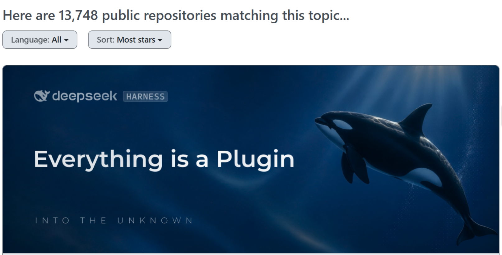
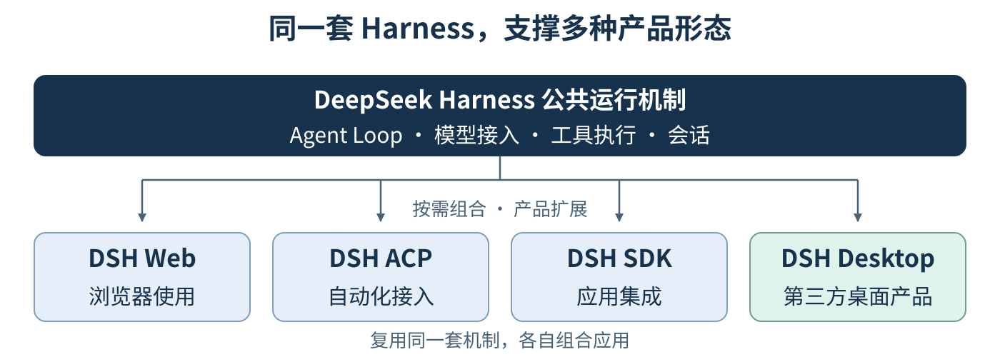
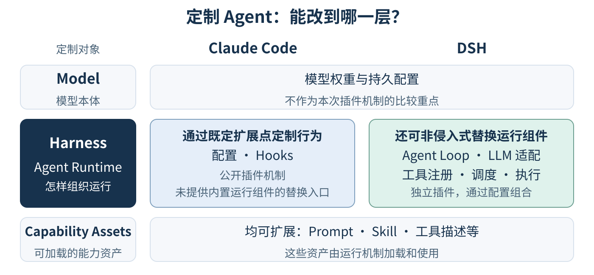
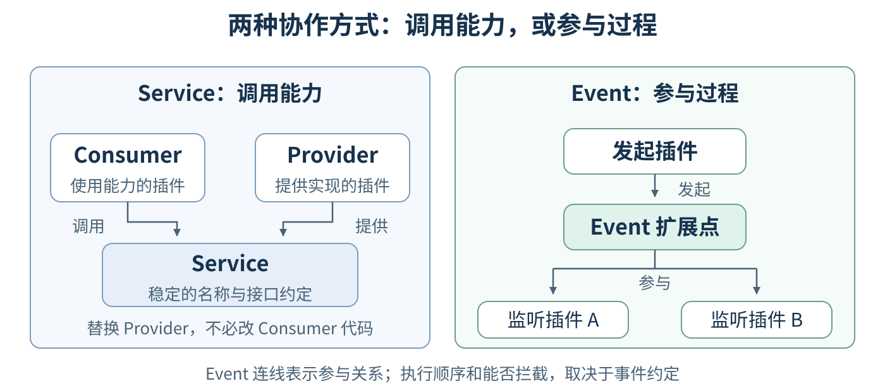
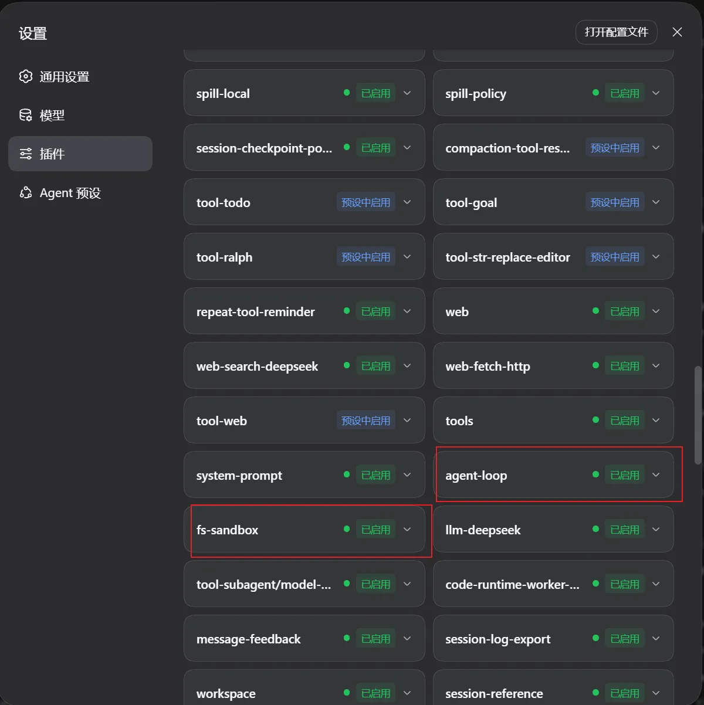
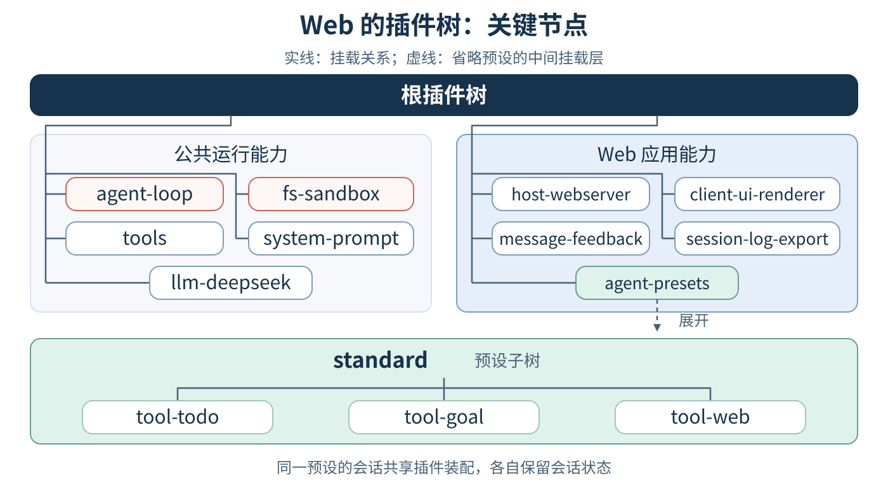
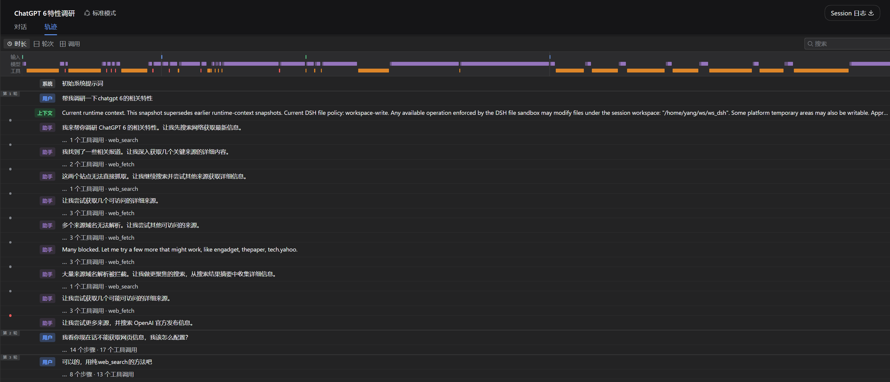
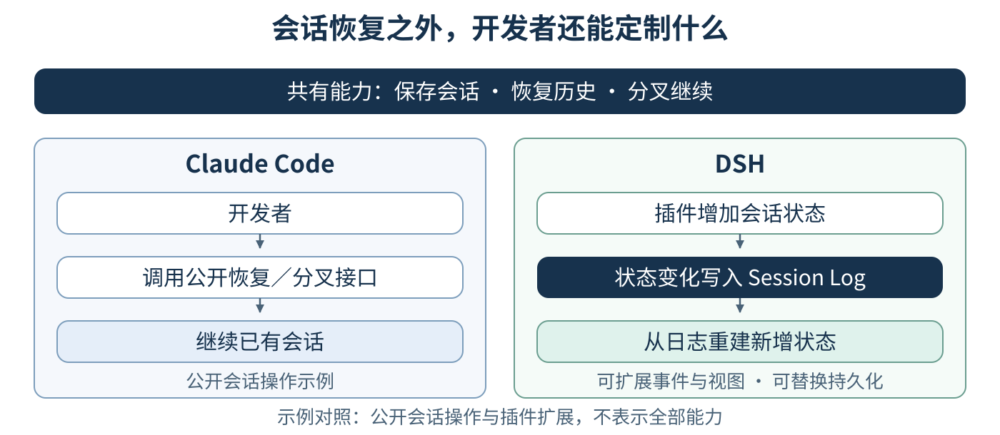

# DeepSeek Harness 有什么不同：从插件组合到会话恢复

## 概述
给 Agent 增加一个工具，和改变 Agent 的运行方式，是一回事吗？

用过 Claude Code 的人，对接入工具、添加 Skill 应该不陌生。比起继续增加能力，我更关心另一个问题：如果想替换 Agent Loop、模型接入或工具调用系统，是否必须直接修改原有实现？

DeepSeek Harness（简称 DSH）把这些运行机制本身也做成了插件。**开发者不仅能扩展 Agent 使用的能力，还能通过独立插件和配置组合，替换让 Agent 运转起来的组件，而不必直接修改原有实现。**

这种可定制性，最终会体现在产品的样子上。DSH Web 面向浏览器中的用户，DSH ACP 面向自动化调用方，DSH SDK 让开发者把 Agent 能力接入自己的应用；独立社区项目 DSH Desktop 则复用 DSH 的 Web 界面、Host 服务和插件系统，增加原生窗口、托盘等桌面能力。它们可以复用同一套 Harness 的公共机制，再组合各自需要的能力和入口。[DSH 应用组合](../docs/architecture.md#profiles-and-bundles)、[DSH Desktop 项目说明](https://github.com/anywhere-labs/dsh-desktop)

*图 2：复用公共运行机制，组合不同能力与入口。连线表示复用与组合，不表示同一运行实例；Desktop 为第三方产品。*

也就是说，**同一套 Harness 可以支撑不同的产品形态，开发者定制的不只是 Agent 的行为，也可以是承载它的整个产品。** 本文沿着 Cordis、Everything is a plugin 和 Session Log 展开，从界面、应用组合和会话恢复这些能直接观察到的能力，理解这种定制方式与 Claude Code 的差异，不深入代码细节。

## 目录

- [DSH 把什么交给了开发者](#dsh-%E6%8A%8A%E4%BB%80%E4%B9%88%E4%BA%A4%E7%BB%99%E4%BA%86%E5%BC%80%E5%8F%91%E8%80%85)
- [Cordis：让插件能够协作和替换](#cordis%E8%AE%A9%E6%8F%92%E4%BB%B6%E8%83%BD%E5%A4%9F%E5%8D%8F%E4%BD%9C%E5%92%8C%E6%9B%BF%E6%8D%A2)
- [Everything is a plugin：组合决定应用的样子](#everything-is-a-plugin%E7%BB%84%E5%90%88%E5%86%B3%E5%AE%9A%E5%BA%94%E7%94%A8%E7%9A%84%E6%A0%B7%E5%AD%90)
- [Session Log：从记录生成上下文和状态](#session-log%E4%BB%8E%E8%AE%B0%E5%BD%95%E7%94%9F%E6%88%90%E4%B8%8A%E4%B8%8B%E6%96%87%E5%92%8C%E7%8A%B6%E6%80%81)
- [一套 Harness，减少重复建设](#%E4%B8%80%E5%A5%97-harness%E5%87%8F%E5%B0%91%E9%87%8D%E5%A4%8D%E5%BB%BA%E8%AE%BE)
- [延伸阅读](#%E5%BB%B6%E4%BC%B8%E9%98%85%E8%AF%BB)

---

## DSH 把什么交给了开发者

这些产品形态背后，开发者究竟能改什么？可以先把影响 Agent 能力的因素分成三个层次：

- Model：模型权重及其持久配置，决定模型本身具备的能力。
- Harness，也就是这里说的 Agent Runtime：组织模型请求、工具执行和会话状态的运行机制，包括 Agent Loop、LLM 适配、工具注册与调度等。
- Capability Assets：供 Agent 加载和使用的能力资产，例如 Prompt、Skill、工具描述、脚本和参考资料。

这不是执行的三个步骤，而是区分定制对象的视角。比如，增加一个工具，让 Agent 多一种操作，与替换负责注册、调度和执行工具的系统，是两件不同的事。脚本或插件属于哪一层，也要看它承担的职责，不能只看文件形式。

*图 3：差异在于运行组件怎样被定制和替换，而不只是能添加多少工具或 Skill。*

Claude Code 的公开插件机制提供 Skills、子 Agent、Hooks、MCP 等扩展。这些扩展既能接入知识和工具，也能通过 Hooks 干预工具执行、影响是否继续工作。定制通过产品提供的扩展点完成；但公开插件机制并没有提供把内置 Agent Loop、LLM 适配或工具调用系统整体换成另一份实现的入口。[Claude Code 插件文档](https://code.claude.com/docs/en/plugins)、[Hooks 文档](https://code.claude.com/docs/en/hooks)

DSH 则把运行组件本身也纳入插件体系。想调整某个环节，可以使用已有扩展点；想替换组件的实现，可以编写符合相应接口的独立插件，再通过配置组合使用它。**这里的“非侵入式替换”，指的是不必直接修改原有组件的实现，不是不用写代码，也不是不受接口约束。** 模型适配、工具注册与执行、会话服务、Agent Loop，乃至 Web 界面，都参与这样的插件组合。[DSH 架构说明](../docs/architecture.md#cordis)

其中，替换 LLM 适配器改变的是 Harness 怎样接入模型，不是修改 Model 层的模型权重。这篇文章关注的是运行机制的定制方式，不据此比较模型本身的能力。

当这些运行组件都成为插件，接下来的问题就是：它们怎样协作，又怎样被替换？这就要从 Cordis 讲起。

---

## Cordis：让插件能够协作和替换

**把各项机制做成插件之后，还需要解决两个问题：插件怎样找到彼此提供的能力？替换或卸载一个插件时，它留下的注册又由谁清理？DSH 使用 Cordis 来管理这些协作和生命周期**。理解这两件事，就能看懂它为什么支持运行机制的组合与替换。

### 插件通过能力协作

**一个工具需要读文件，可以调用文件服务；需要调用模型，可以调用模型服务**。这里的 Service，是有名称和接口约定的能力。使用能力的插件是 Consumer，提供具体实现的插件是 Provider。Consumer 依赖的是服务，不必直接引用某个 Provider 的实现；只要替代实现满足相同的服务名称和接口约定，就不必跟着修改 Consumer 的代码。

**另一类需求，是让其他插件参与一个过程**。例如，在工具执行前做权限检查，在模型请求前加入上下文。这类协作可以通过 Event 完成：发起插件提供扩展点，监听插件按约定参与，发起方不必知道有哪些插件在监听。监听器能否修改结果、拦截后续执行，以及按什么顺序运行，都由具体事件的分发约定决定。

*图 4：Service 连接能力的使用者与提供者，Event 让其他插件参与已有过程。*

对应到开发者手里的选择，就有两种改法：只想调整某个环节，可以在已有扩展点加入插件；想改变整套机制，则可以提供满足相应接口的替代实现。**Agent Loop 本身也是插件，意味着执行循环的实现也可以由开发者决定。** 工具和策略同样有各自的扩展位置，并不是每次定制都需要改 Loop。[Cordis 入门](../docs/cordis-primer.zh.md)、[DSH 扩展位置](../docs/architecture.md#where-new-behavior-goes)

### 插件可以加载，也可以退出

知道怎样协作之后，还要看插件何时能够运行。一个工具插件声明自己依赖文件服务，并不需要猜测文件服务由哪个插件先启动：Cordis 会等它声明的全部必需服务就绪，再激活它。这里的条件是“服务就绪”，不只是 Provider 已经挂载，因为服务也可能需要初始化。

这个依赖关系在运行期间仍然有效。任一必需服务消失，依赖它的插件会停用；必需服务恢复后，插件可以重新激活。Cordis 同时把工具、服务和事件监听器等注册与插件实例的生命周期关联起来，插件停用或卸载时，会撤销自身的这些注册。[服务依赖](../docs/cordis-tutorial/03-services.zh.md)、[生命周期与副作用](../docs/cordis-tutorial/02-lifecycle-and-effects.zh.md)

*图 5：服务依赖是持续的运行条件，注册效果随插件的激活与停用一同进入和退出。*

对应到工具列表，变化就很直观：工具插件激活时注册工具，停用时撤销注册；Agent 下一次组装工具列表时，读取的是当时注册表里可用的工具。Service 让调用方不必绑定具体实现，Event 提供参与过程的扩展点，依赖与生命周期管理则让这些插件能够进入和退出运行。

这就是理解“运行时重组”的关键：变化既能被应用，相应的注册也能随插件退出而撤销。不过，框架支持什么，与具体应用默认开启什么，要分开看。当前内置 Web Profile 支持配置热重载，ACP、SDK、SDK Minimal 等 Profile 在启动时应用配置；插件代码的模块热更新需要另行启用。**配置热重载不等于任意组件都能无损升级**，正在进行的工作能否保留，还要看具体组件。[Profile 加载策略](../docs/architecture.md#profiles-and-bundles)

---

## Everything is a plugin：组合决定应用的样子

Everything is a plugin 听起来很抽象。它到底覆盖了哪些东西？先看 DSH Web 的设置界面：工具、模型服务和 Agent 的运行机制，都出现在同一份插件清单里。

### 从设置界面看见插件

*图 6：DSH Web 的真实插件清单。截图及红框标注由作者提供。*

先留意红框里的两个名字：`agent-loop` 驱动 Agent 的执行循环，`fs-sandbox` 负责带沙箱策略的文件访问。再看同一屏的 `tools`、`system-prompt` 和 `llm-deepseek`，它们分别提供工具注册与执行机制、组织系统提示、接入模型。这里列出的，既有模型能调用的工具，也有让 Agent 运转起来的基础机制。

还有一个容易忽略的细节：有些条目显示“已启用”，有些显示“预设中启用”。前者表示该条目在应用的全局配置中启用；后者表示全局条目没有直接启用，而是有 Agent Preset 提供这项插件，比如 `tool-todo` 和 `tool-web`。Preset 可以先理解为供会话选择的一组 Agent 能力。“预设中启用”不代表所有会话都有这项工具，也不表示对应预设此刻一定已经运行。[插件清单界面](../packages/client/ui-settings-plugin-inventory/README.md)

### 从插件清单映射到 Plugin Tree

清单告诉我们有哪些插件，但还没有展示它们挂在哪里、哪些插件属于同一棵子树。把刚才的名字放回 Plugin Tree，关系就更直观了。下图保留 Web 配置的关键节点，并展开 `standard` 预设的一小部分。

*图 7：按 Web 的真实配置选取节点；名称省略* `@deepseek-ai/dsh-` *前缀。以* `standard` *已被会话使用为例，虚线省略了预设的中间挂载层；背景分区仅用于阅读，不是额外的父插件。*

先看应用层：模型访问、会话持久化、沙箱、工具注册表等公共服务在这里，Web 服务和界面也在这里。再看预设子树：会话使用的工具、提示词和 Skill 由它提供。同一个 Web 进程可以同时服务使用不同预设的会话；使用同一预设的会话共享那组插件的装配，各自的会话状态仍然独立。[Web 配置](../packages/bundle/web-app/cordis.patch.yml)、[Standard 预设](../packages/preset/agent-presets/presets/standard/agent.cordis.yml)、[Agent Presets](../packages/preset/agent-presets/README.md)

拿网页搜索举个例子。截图中的 `web-search-deepseek` 提供搜索服务，`tool-web` 把网页能力作为工具提供给模型。前者属于共享服务，后者由预设决定是否提供给会话。也就是说，**应用具备一项基础能力，不等于每个会话里的 Agent 都能调用相应工具。** 这两件事可以分别配置。

读图时还要注意：树上的连线表示挂载层次，不是调用顺序。`fs-sandbox` 与 `agent-loop` 并列，也不意味着两者互不依赖。服务如何被找到、哪些注册对某个会话可见，由 Cordis 的 Context 和作用域机制管理。这里不展开这些机制，只保留一个理解：插件树组织运行中的能力，同时允许控制能力的可见范围。

### Web 与 ACP：改变应用面向谁

看清一棵树之后，可以继续问：如果换一种组合，应用会变成什么样？先比较 `web` 和 `acp`。它们是两套命名的启动配置，DSH 把这样的配置称为 Profile。

Web 面向浏览器中的人，所以组合里有 Web 服务、会话界面、设置页和预设选择。ACP 是 Agent Client Protocol；DSH 的 ACP Profile 面向自动化调用方，提供通过标准输入输出通信的 ACP 服务，让其他程序提交任务、接收更新和管理会话。两者复用模型、Agent Loop、工具和持久化等公共插件，但启动的是各自独立的应用。[Web Bundle](../packages/bundle/web-app/README.md)、[ACP Bundle](../packages/bundle/acp-app/README.md)

*图 8：保留公共运行能力，改变应用入口与会话能力的组织方式。图中按能力分组，不表示插件之间的父子关系。*

| 对比项 | `web` | `acp` |
| --- | --- | --- |
| 直接使用者 | 在浏览器里工作的用户 | 实现 ACP 的自动化调用方 |
| 交互方式 | 会话界面、设置页、模型与预设选择 | 协议请求、响应和会话更新；不包含 Web 界面 |
| Agent 能力组织 | 公共服务加预设；会话选择对应能力组合 | 默认使用应用中挂载的工具组合，不包含 Web 的预设管理 |
| 配置生效 | 内置 Profile 支持配置热重载 | 内置 Profile 在启动时应用配置 |

我觉得这组对比有意思的地方，在于组合决定了应用面向谁。Web 需要展示、设置和预设管理，ACP 不必全部携带；ACP 需要的协议服务，则作为插件与公共能力组合。开发者选择的不只是一个访问入口，也包括这个应用需要哪些功能。

### SDK 与 SDK Minimal：改变模型实际拿到什么

如果调用方式不变，插件组合还会带来什么差异？`sdk` 与 `sdk-minimal` 正好说明另一件事：应用都可以通过 DSH 的 SDK JSON-RPC 协议供程序调用，都保留模型请求、Agent Loop、Session Log 与持久化，但模型实际拿到的工具和上下文可以很不一样。

`sdk` 提供完整的默认 Agent 组合，包含 Shell、文件操作、搜索、Skill、子 Agent 等工具及配套服务。`sdk-minimal` 则独立列出自己需要的插件，默认只向模型提供持久 Shell 和文本编辑两种工具。这里先明确一点：**Minimal 精简的是能力组合，不是换了更小的模型，也不是另一套 SDK 协议。** [SDK Bundle](../packages/bundle/sdk-app/README.md)、[SDK Minimal Bundle](../packages/bundle/sdk-minimal/README.md)

*图 9：调用方式相近，不代表模型面对的工作环境相同。*

| 对比项 | `sdk` | `sdk-minimal` |
| --- | --- | --- |
| 默认模型工具 | Shell、文件操作与搜索、Skill、子 Agent、Todo、Web 等 | 持久 Shell 与文本编辑 |
| Shell 形态 | 默认 Shell 工具及后台任务控制工具 | 持久 Shell，在多次调用之间保留状态；不提供单独的后台任务控制工具 |
| 提示上下文 | 系统提示、运行环境信息、工作区指令等上下文贡献 | 简短默认提示，不加入 Harness 身份与运行环境段落，也不组合工作区指令插件 |
| 配套能力 | 包含上下文压缩、Skill 加载、子 Agent、设置等插件 | 默认不组合这些插件 |
| 会话基础 | 模型调用、循环执行、会话日志与持久化 | 同样保留，日志默认保存为未压缩 JSONL |

把这些差异放进一个任务里更容易理解。同样要求“检查项目并修改一个文件”，普通 SDK 的 Agent 可以使用专门的文件与搜索工具，也可以使用预先组合好的 Skill 或子 Agent；Minimal 的 Agent 主要通过 Shell 检查项目，再用文本编辑工具修改内容。任务没有变，模型可选择的操作、开始工作时获得的信息，却随着插件组合发生了变化。

不过，“工具少”不能直接理解为“权限小”。Minimal 的持久 Shell 在 Linux、macOS 上使用 Bash，在 Windows 上使用 PowerShell，默认采用 `danger-full-access`；文本编辑直接使用本地文件系统，运行环境的隔离需要由调用方负责。选择哪一种组合时，除了看工具和上下文，也要看它们各自的权限配置。[Minimal 配置](../packages/bundle/sdk-minimal/cordis.patch.yml)

### 插件树是怎样组合出来的

前面已经看到了不同组合的结果。接下来再看配置：从选择 `web`，到真正运行起那棵插件树，中间发生了什么？

这里需要区分 Plugin、Bundle 和 Profile。Plugin 提供具体能力；Bundle 分发一组插件配置及其依赖；Profile 决定本次启动按什么顺序使用哪些 Bundle。配置被加载后，才形成运行中的 Plugin Tree，也就是插件的挂载结构。

把前面四个 Profile 放在一起看，区别就很明确：

| Profile | 按顺序应用的 Bundle |
| --- | --- |
| `web` | `dsh-base` → `dsh-web-app` |
| `acp` | `dsh-base` → `dsh-acp-app` |
| `sdk` | `dsh-base` → `dsh-sdk-app` |
| `sdk-minimal` | `dsh-sdk-minimal`，独立提供完整配置，不叠加 `dsh-base` |

那如果想沿用一个 Bundle，但调整其中某个插件呢？这就要用到 Patch。Bundle 本身通过 Patch 提供配置；Patch 既可以插入插件条目，也可以按条目的标识调整配置或启停状态。

组合从空配置开始，先按顺序应用 Bundle 的 Patch，再应用 Profile 自己的 Patch、Harness Home 中的 Patch，以及本次启动额外指定的 Patch。后面的层可以覆盖前面的选择，最终配置交给 Cordis 加载。下图把这个过程和最后的插件树连在了一起。

*图 10：Bundle 是配置来源，不必成为树中的父节点。来自不同 Bundle 的插件可以在同一层挂载。*

回到 Web 这个例子，`dsh-base` 提供 `agent-loop`、`fs-sandbox` 等条目；`dsh-web-app` 加入 Web 服务、界面和 `agent-presets`，同时调整部分基础条目，把模型工具交由预设提供。所以，组合 Bundle 既可以增加插件，也可以改变已有插件的配置和启用位置。

最后再区分两个名字相近的概念：**Profile 选择整个应用，Preset 选择会话使用的 Agent 能力。** 再回头看 Web 设置页中的“已启用”和“预设中启用”，就能把界面上的状态与背后的组合方式对应起来了。[Profile 与 Bundle](../docs/architecture.md#profiles-and-bundles)、[Agent Presets](../packages/preset/agent-presets/README.md)

---

## Session Log：从记录生成上下文和状态

前两部分讲的是 Agent 由什么组成。接下来看另一个问题：Agent 工作了一段时间，进程退出了，再打开时凭什么接着做？

这就涉及 Session Log。在 DSH 中，它是一条持续追加的会话事件序列，记录用户输入、模型响应、工具调用与结果，以及需要保存的会话状态。理解它的重点，是看这些记录怎样被后续运行使用。

### 先看一次会话留下的记录

下面是 DSH Web 的“轨迹”视图。它把会话事件整理成按轮次和步骤组织的记录，并用顶部时间概览展示输入、模型与工具活动。**这里看到的是 Session Log 的一种可视化呈现，不是原始日志文件本身。**

*图 11：一次调研会话留下的执行记录。截图由作者提供；点击图片可查看原图。*

读这张图，可以先看三个地方：

- 顶部的时间概览，把输入、模型和工具活动放在同一条时间轴上，呈现它们在会话中的分布。
- 下方的记录不只有用户提问和助手回答，还能看到初始化系统提示、注入的运行上下文，以及搜索、网页获取等工具调用。
- 左侧的轮次与其中的步骤，说明一次用户请求可能包含多次模型请求和工具调用，并不是“一问一答”就结束了。

这样看，Session Log 保存的就不只是最终回答，而是会话中记录下来的输入、模型响应、工具调用与结果，以及上下文等信息。轨迹界面会把这些事件组装成便于阅读的记录，也会折叠或汇总部分内容，所以界面中的一行不一定对应原始日志中的一条事件。[轨迹视图说明](../packages/client/ui-trajectory/README.zh.md)

### 模型看到的内容，必须能够从日志重建

这些记录并不只供人回看。比如，截图中的 Agent 发起搜索后，下一次模型请求需要使用相应的工具调用和结果。这段对话历史就要能够从日志重新生成；运行时额外注入的上下文，同样需要有日志依据。

DSH 把这件事规定为一条架构规则：**模型可见的内容，必须能够从 Session Log 重建。** 因此，日志同时参与运行和展示：模型使用的历史、用户查看的执行过程，以及由事件记录的 Goal、Todo 等状态，都可以从同一条事件流生成各自的视图。[Session Log 架构规则](../docs/architecture.md#session-log)

*图 12：同一份会话事实，可以服务于模型、用户界面和后续会话操作。*

刚才的轨迹界面，对应图中的“会话执行历史”分支。同一份日志，为什么还需要不同视图？看上下文压缩就容易理解：压缩会改变下一次模型请求使用的历史，但已经发生的会话事实仍保留在日志里。用户可以查看的历史，与模型这一轮实际使用的上下文，不必完全相同。

### 恢复会话时，恢复的是什么

进程退出后，新进程可以读取已保存的日志，重建会话历史和相关状态，再继续追加新的输入、模型响应和工具结果。分叉则从选定的历史位置开始形成另一条会话。也就是说，原有记录直接成为继续工作的依据。[Session 子系统](../docs/subsystems/session.zh.md)

不过，这里恢复的是会话，不是整个运行环境。工作区文件可能已经变化，旧的 Shell 进程可能已经结束，外部服务也可能返回不同结果。日志保存了会话事实，不代表这些外部条件都能还原到过去，更不保证模型再次执行时给出完全相同的答案。

### DSH 与 Claude Code 的会话能力

那么，这与 Claude Code 的会话恢复有什么不同？先看两者共有的能力：Claude Code 也会持久保存会话，并通过这些记录恢复对话历史、工具调用和结果；它的 SDK 也支持恢复和分叉。两者都能在已有对话的基础上继续工作，不能仅凭“能恢复会话”来区分它们。[Claude Code 会话管理](https://code.claude.com/docs/en/sessions)、[Claude Agent SDK 会话管理](https://code.claude.com/docs/en/agent-sdk/sessions)

这里值得关注的，仍然是开发者能控制什么。DSH 向开发者开放会话机制的组成和扩展方式：会话事件是模型上下文及多种产品视图的共同依据，可以围绕这些事件增加持久状态和视图，也能替换持久化实现。

比如，你通过插件增加了一项需要在恢复后保留的会话状态，就可以把它的变化写成事件，再从历史事件恢复相应状态。这样，插件体系与 Session Log 就连起来了：新增能力也能参与会话的记录与延续。

*图 13：恢复会话是共有能力；DSH 的插件体系让新增状态也能参与记录、展示与恢复。图中比较的是本节讨论的公开使用和扩展方式。*

---

## 一套 Harness，减少重复建设

对我来说，DSH 最重要的价值，是让不同 Agent 产品复用同一套可定制的运行机制，减少重复建设。

前面介绍的 Web、ACP、SDK 和第三方 Desktop，体现的正是这种复用方式：产品入口与交互可以不同，模型接入、工具执行、会话记录与恢复等公共机制可以复用，再通过插件组合各自需要的能力。[DSH 应用组合](../docs/architecture.md#profiles-and-bundles)

当已有组件能够满足通用需求时，团队就不必为每个产品重新开发、维护整套 Harness；需要差异化的部分，则通过插件扩展或替换。这样，投入可以更多地集中在场景特有的工具、工作流程和交互体验上。

> 一套可定制的 Harness，可以支撑不同的 Agent 产品，而不必为每个产品重复建设运行机制。

这里的成本收益来自工程复用，不意味着模型调用费用自动降低。实际能节省多少，取决于复用程度与定制需求；DSH 仍处于开发者预览阶段，也需要考虑升级适配的投入。[项目状态](../README.md#developer-preview)

---

## 延伸阅读

- [DSH 架构说明](../docs/architecture.zh.md)：插件组合、运行过程和 Session Log 的完整关系。
- [Cordis 入门](../docs/cordis-primer.zh.md)：服务、事件、依赖和插件生命周期的基本机制。
- [SDK Minimal](../packages/bundle/sdk-minimal/README.md)：精简组合提供的工具及其使用条件。
- [Session 子系统](../docs/subsystems/session.zh.md)：会话事件、存储与恢复的进一步说明。

## 开发备注

无。
