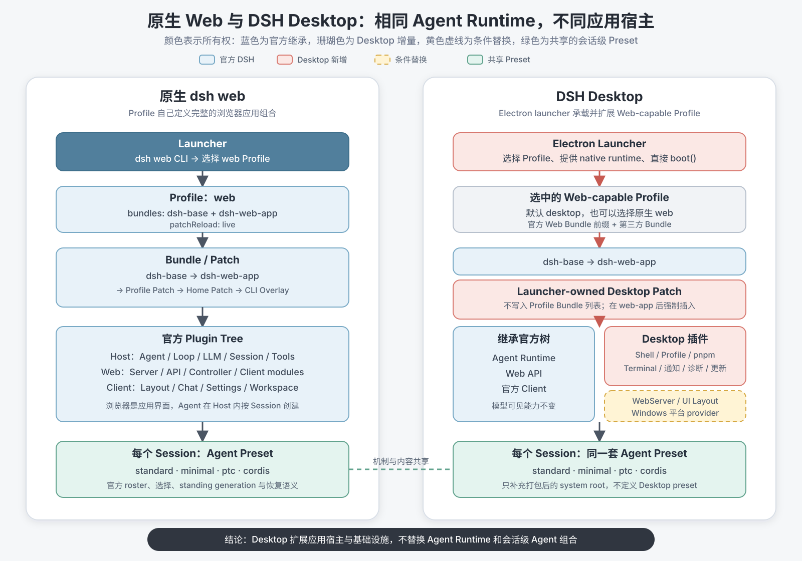
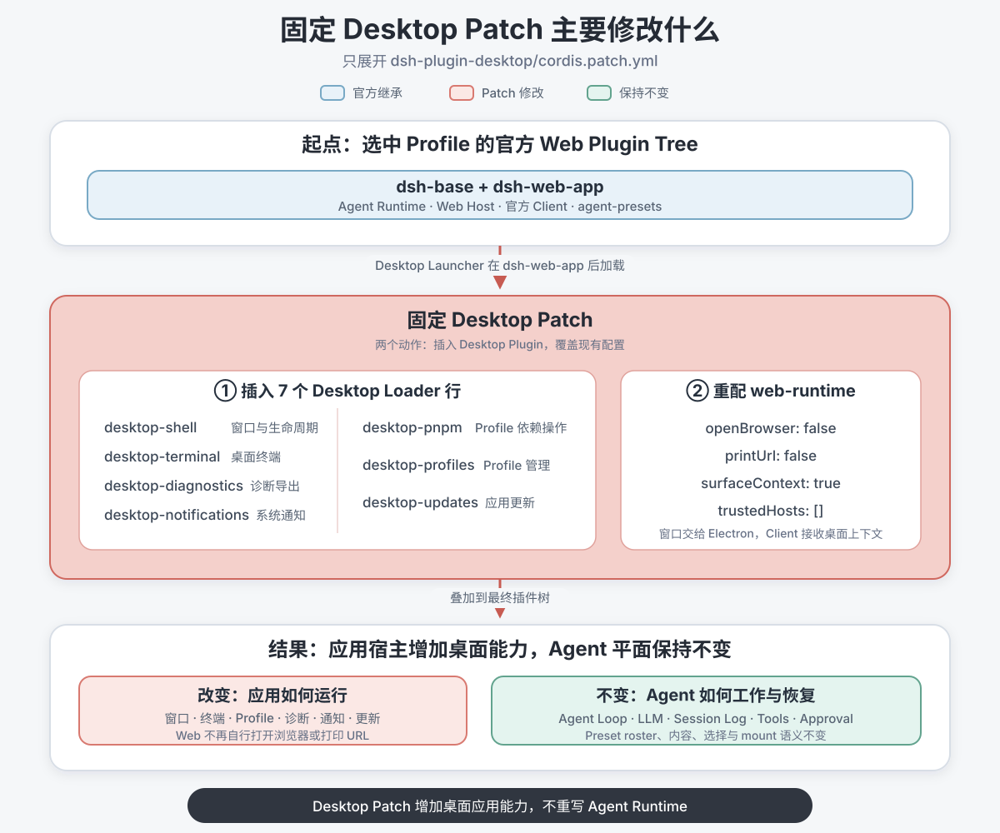

# DSH Desktop 与原生 `dsh web` 差异分析

## 概述

本文比较 DeepSeek Harness 原生 `dsh web` 与社区项目 DSH Desktop 的应用装配方式。两者不是同一抽象层上的两个实现：原生 `web` 是一个 Profile 模板，DSH Desktop 则是一个能够选择 Web-capable Profile、补充 Desktop Patch 并在 Electron 中启动最终 Cordis 插件树的产品宿主。Desktop 继承官方 Agent Runtime、Web Client 和 Agent Preset 机制，主要增加原生窗口、Profile 管理、插件管理、终端、通知、诊断、更新与恢复能力。理解这一区别，可以避免把 Desktop 误认为一套新的 Agent Loop、Session 格式或 Agent Preset 系统。

## 目录

- [明确比较边界](#comparison-boundary)
- [建立统一逻辑模型](#unified-model)
- [比较 Profile](#profile-comparison)
- [比较 Bundle 与 Patch](#bundle-patch-comparison)
- [比较 Plugin Tree](#plugin-tree-comparison)
- [比较 Agent Preset](#preset-comparison)
- [比较生命周期与持久化](#lifecycle-comparison)
- [理解它验证了哪些 Harness 能力](#architecture-implications)
- [形成差异性结论](#conclusions)
- [按顺序阅读源码](#source-reading)
- [开发备注](#dev-note)

-----

<a id="comparison-boundary"></a>
## 明确比较边界

直接把“DSH Desktop”和“`web` Profile”放在同一行比较会丢失一个关键层次：前者是完整产品和启动器，后者是应用装配模板。本文先把两者放进同一套层次，再比较每一层由谁提供、谁拥有状态以及何时生效。

| 对象 | 原生 `dsh web` | DSH Desktop |
|---|---|---|
| 产品入口 | `dsh web` CLI | `dsh-desktop` Electron 应用 |
| 默认 Profile | 随附模板 `web` | Desktop 管理的 `desktop`，也可选择其他 Web-capable Profile |
| 基础 Bundle | `dsh-base + dsh-web-app` | 仍以所安装 DSH 的 `PROFILE_TEMPLATES.web` 为基础 |
| 应用增量 | Web Profile、Home 与命令行 Patch | Desktop 启动器 Patch、Profile 第三方 Bundle、用户 Patch 及平台生成的 Patch |
| 最终进程 | Node Host 加浏览器 Client | Electron main 内的 DSH Host，加沙箱化 Web renderer 和原生 runtime |
| 每会话 Agent | 由官方 Agent Preset 组装 | 仍由同一套官方 Agent Preset 组装 |

本文的官方侧依据当前工作区源码；DSH Desktop 侧固定到仓库修订 `469aa633ddaa0b4726faf9abc70fb2ccb9c3d3ae`，避免外部 `master` 更新后让结论失去对应代码。该 Desktop 修订将 DSH runtime 固定为 `0.1.2-rc.1`、上游提交 `a66e4702047846cdaa10c66c9d3df3951f5ea70d`。因此，本文把“Desktop 主动增加或替换的结构”与“两份 DSH 版本之间普通的上游演进”分开；某个官方插件在两个版本中的增删不自动算作 Desktop 定制。

-----

<a id="unified-model"></a>
## 建立统一逻辑模型

两条路径最终都产生一棵 Cordis 插件树，但组合权威不同。原生路径由 `dsh` CLI 和 Profile loader 完成；Desktop 路径由 Electron 启动器先解析 Profile，再插入一个不写入 Profile manifest 的产品层。

```text
原生 dsh web
  dsh CLI
    → web Profile
      → dsh-base Bundle
      → dsh-web-app Bundle
      → Profile / Home / CLI Patch
        → Host Plugin Tree + Web Client Plugin Tree
          → 每个 Session 选择 Agent Preset

DSH Desktop
  Electron launcher
    → 选择一个 Web-capable Profile（默认 desktop）
      → dsh-base Bundle
      → dsh-web-app Bundle
      → Desktop launcher-owned Patch
      → Profile 中的第三方 Bundle
      → Profile / Home Patch
      → 平台与运行模式生成的最终 Patch
        → 官方 Host/Client Tree + Desktop Host/Client Plugin
          → 每个 Session 仍选择官方 Agent Preset
```



这张图只表达一个结论：Desktop 在官方 Web 应用组合之外增加原生宿主能力，但没有另建 Agent Runtime 或会话级 Agent 组合体系。

| 层次 | 原生 Web 的所有者 | Desktop 的处理 |
|---|---|---|
| Launcher | `dsh` CLI | Electron main 自己调用 `dsh-app-boot.boot()` |
| Profile | `web` 模板和用户持久化目录 | 选择 Web-capable Profile；只主动修复默认 `desktop` Profile |
| Bundle/Patch | Profile 按顺序列出 Bundle，再叠加用户 Patch | 沿用 Profile Bundle，同时在 `dsh-web-app` 后强制插入 Desktop Patch |
| Plugin Tree | Loader 激活最终配置行 | 同一个 Loader 激活官方、Desktop 和第三方插件 |
| Agent Preset | Web Session Controller 选择，`dsh-agent-presets` 发现并挂载 | 沿用相同服务和选择路径，只适配打包后的 preset 根目录 |

-----

<a id="profile-comparison"></a>
## 比较 Profile

Profile 回答“这次启动采用哪组有序应用层”，不直接等于某个 Agent，也不拥有每个插件的实现。原生 Web 和 Desktop 都使用这一抽象，但 Desktop 在 Profile 之外还持有产品级选择状态。

### 原生 `web` Profile

原生 `dsh web` 是 `dsh --profile web` 的别名。首次使用时，`dsh-app-boot` 根据 `PROFILE_TEMPLATES.web` 创建 `$DSH_HOME/profiles/web`，其安装所有的固定前缀是：

```text
@deepseek-ai/dsh-base
@deepseek-ai/dsh-web-app
```

该模板声明 `patchReload: live`。官方 Profile 启动路径加载 Bundle、Profile Patch、Home Patch 和本次命令行 Patch，并为 Profile 与 Home Patch 安装 watcher。

### Desktop 的 Profile

Desktop 默认使用名为 `desktop` 的持久 Profile。它调用所安装 `dsh-app-boot` 的 `PROFILE_TEMPLATES.web` 获取基础 Bundle 和 `patchReload` 值，而不是复制一份手写的官方 Bundle 清单。首次创建或后续修复 `desktop` Profile 时，它确保官方 Web Bundle 位于最前面，同时保留已有第三方 Bundle 的相对顺序：

```text
dsh-base
→ dsh-web-app
→ 第三方 Bundle 1
→ 第三方 Bundle 2
→ ...
```

Desktop 还可以从托盘选择另一个现有 Profile，但候选必须能够直接组合 `dsh-base` 和 `dsh-web-app`。官方 `web` Profile 可以被选择；`headless`、损坏的 Profile 或已经把 Desktop 自身持久化进 Bundle 列表的 Profile 不会作为可用的 Desktop 应用入口。

当前选中的 Profile 名称不写入该 Profile 的 `package.json` 或 `settings.yaml`。Desktop 把选择状态存放在 Electron user-data 下，并通过重启进入目标 Profile。每个 generation 内，`ctx.desktopProfiles.current` 才是当前 Profile 名称和绝对目录的权威值。

### Profile 层的关键差异

| 问题 | 原生 `dsh web` | DSH Desktop |
|---|---|---|
| 谁选择 Profile | CLI 参数或 `web` 别名 | Electron 私有选择状态和托盘操作 |
| 默认名称 | `web` | `desktop` |
| 是否只运行一个固定 Profile | 是，本次进程由 CLI 选择 | 否，产品可以选择任意满足要求的 Web-capable Profile |
| 谁维护 manifest | `dsh` 初始化，之后由用户和插件命令维护 | 只对 `desktop` Profile 修复官方 Web 前缀；其他 Profile 保持自己的 manifest |
| 切换方式 | 结束当前命令，再用另一个 Profile 启动 | dispose 当前 Cordis generation，再重启 Electron |
| Desktop 功能是否写进 Bundle 列表 | 不适用 | 否，启动器在内存组合中强制插入 |

所以，“Desktop 使用 `desktop` Profile”只描述默认选择；更完整的说法是：“Desktop 启动器承载一个 Web-capable Profile，并在它的 Web Bundle 后加入 Desktop 产品层。”

-----

<a id="bundle-patch-comparison"></a>
## 比较 Bundle 与 Patch

Bundle 是 Patch 的分发单位，Patch 则对配置行进行插入、禁用或整段 `config` 替换。两边都使用相同的 Cordis Loader 语义，主要差别在于 Desktop 新增了 Profile 之外的组合权威。

### 原生 Web 的层顺序

| 顺序 | 层 | 主要内容 |
|---:|---|---|
| 1 | `dsh-base/cordis.patch.yml` | Agent、Session、LLM、持久化、注册表、沙箱、审批与默认工具组合 |
| 2 | `dsh-web-app/cordis.patch.yml` | Web Host、API、浏览器 Client roster、Web 配置覆盖及 Agent Preset roster |
| 3 | `profiles/web/cordis.patch.yml` | 当前 Web Profile 的用户覆盖 |
| 4 | `$DSH_HOME/cordis.patch.yml` | 本机所有 Profile 共用的覆盖 |
| 5 | `--patch` | 本次 CLI 调用的临时 overlay |
| 6 | Launcher 最终覆盖 | 例如通过环境变量禁用遥测 |

### Desktop 的层顺序

| 顺序 | 层 | 主要内容 |
|---:|---|---|
| 1 | 选中 Profile 的 `dsh-base` | 官方基础 Host Runtime |
| 2 | 选中 Profile 的 `dsh-web-app` | 官方 Web 应用 |
| 3 | Desktop 静态 Patch | 七个 Desktop Loader 行和 `web-runtime` 配置 |
| 4 | Profile 中其余第三方 Bundle | 普通 DSH Bundle；可由 Desktop 的插件管理能力启停 |
| 5 | 选中的 Market provider | 启用时由启动器筛选并插入 |
| 6 | Profile Patch | 选中 Profile 自己的用户覆盖 |
| 7 | Home Patch | 共享 Harness home 覆盖 |
| 8 | Desktop 生成 Patch | 设置、网络、UI 模式、preset 根、平台 adapter、WebServer、遥测与 shell 配置 |



图中只展开固定的 `dsh-plugin-desktop/cordis.patch.yml`：它插入七个 Desktop Loader 行，并重配官方 `web-runtime`。这些改动为 Web 应用增加桌面宿主能力，但不会替换 Agent Runtime、Session 日志或 Agent Preset 语义。

`dsh-plugin-desktop/package.json` 自己声明了 `dsh.bundle.patch`，所以这个包具备普通 DSH Bundle 的分发形式。但是 Desktop 产品启动器会把 `dsh-plugin-desktop` 从默认 `desktop` Profile 的持久 Bundle 列表中排除，并在遍历到 `dsh-web-app` 后加载同一个 Patch。由此产生两个同时成立的事实：

- 对独立安装和 DSH 插件工具而言，`dsh-plugin-desktop` 是一个声明了 Patch 的 Bundle 包。
- 对 DSH Desktop 产品自身而言，这个 Patch 是启动器所有的强制层，不是用户 Profile 可以遗漏或关闭的普通 Bundle。

这正是简单公式“Plugin 被 Bundle 组合，Bundle 被 Profile 组合”覆盖不到的情况。更准确的公式是：

```text
Plugin Tree
= Profile 中的 Bundle Patch
+ 产品启动器插入的 Patch
+ Profile/Home/命令行等用户 Patch
+ 启动期根据环境生成的 Patch
```

所有最终行为仍由 Cordis Plugin、Service、事件与 effect 实现，但并非每一条 Patch 都必须来自 Profile manifest 中列出的 Bundle。

-----

<a id="plugin-tree-comparison"></a>
## 比较 Plugin Tree

Desktop 没有复制整棵 Web 插件树。它先继承官方树，再通过少量新增行、服务提供和 provider 替换把 Web 应用放进原生桌面宿主。

### 两边共享的官方插件

| 平面 | 共享能力 |
|---|---|
| Host Agent Runtime | Agent registry、Agent Loop、LLM adapter、Session log、持久化、投影、设置、凭据、Storage、Sandbox、Approval、工具与 capability registry |
| Web Host | Web 应用启动、API Gateway、Session/Settings/Workspace Controller、静态前端、Connection 与 Client module 扫描 |
| Web Client | 官方 layout、sidebar、conversation、chat、settings、approval、model、permission、preset、tool 与 workspace 等 UI 插件 |
| Agent plane | `dsh-agent-presets` 和每个 preset 内的 persona、工具、skill、compaction、计划与委派组合 |

这部分是 Desktop 的主体。Desktop 项目自己的文档也把 Model Experience 标为 `None`：Desktop 包不新增模型可见的提示词、工具、事件或请求字段，模型请求仍由相同的 DSH Host 与 Agent 插件组装。

### Desktop Patch 固定增加的 Loader 行

Desktop 的静态 `cordis.patch.yml` 在 `dsh-web-app` 后插入七个 Host 行：

| 行 id | 包入口 | 主要职责 |
|---|---|---|
| `desktop-shell` | `dsh-plugin-desktop` | BrowserWindow、导航策略、Desktop 设置及关闭/退出生命周期 |
| `desktop-terminal` | `dsh-plugin-desktop/terminal` | 打开指向当前 Profile 的隔离终端；Linux 默认禁用 |
| `desktop-diagnostics` | `dsh-plugin-desktop/diagnostics` | 日志与诊断导出 |
| `desktop-notifications` | `dsh-plugin-desktop/notifications` | 原生完成和失败通知 |
| `desktop-pnpm` | `dsh-plugin-desktop/pnpm` | 使用随应用打包的 pnpm 操作当前 Profile |
| `desktop-profiles` | `dsh-plugin-desktop/profiles` | Profile 列举、选择和相关托盘入口 |
| `desktop-updates` | `dsh-plugin-desktop/updates` | 版本检查、下载和平台更新交接 |

同一个 Patch 还把 `web-runtime.openBrowser` 和 `printUrl` 设为 `false`。原生 Web 会把 URL 交给终端用户或默认浏览器；Desktop 则由 Electron 创建 BrowserWindow 并加载已认证的 loopback 页面。

### Launcher 在 Loader 激活前提供的能力

不是所有 Desktop 能力都先表现为 YAML 行。Electron launcher 在调用 `boot()` 时，通过 Host bootstrap callback 直接提供 generation-scoped runtime 服务，再让 Desktop Loader 行消费：

| 能力 | 性质 | 使用者 |
|---|---|---|
| `desktopRuntime` | Electron 窗口、托盘、系统对话框和平台 adapter 的私有能力 | Desktop 自有插件 |
| `desktopBrowserAccess` | renderer 与普通浏览器访问策略 | Desktop shell 与网络层 |
| `desktopLanHttps` | 局域网 HTTPS edge 和本地 CA 状态 | Desktop shell |
| `desktopPnpmBootstrap` | 打包 pnpm 的内部启动能力 | `desktop-pnpm` |
| `desktopActions` | 打开终端与请求重启 | Desktop UI 和 Host 插件 |
| `desktopProfiles` | 当前 Profile、列举、创建、删除和切换 | Desktop 和适配过的第三方插件 |
| `desktopPlugins` | 可选的直接 Bundle 清单及启停操作 | Community Market provider 启用时 |

这种做法没有绕开插件系统。启动器提供的是原生环境能力，Loader 中的插件仍负责注册路由、设置、UI、命令与 effect，并随 Cordis generation 一起释放。它同时表明，Profile/Bundle 不是启动器向插件暴露宿主资源的唯一方式。

### Desktop 条件替换和最终覆盖

Desktop 会根据平台、网络与显示模式生成最后一组 Patch：

| 目标 | Desktop 行为 | Agent 平面是否改变 |
|---|---|---|
| `webserver` | 禁用选中 Profile 的 provider，插入或启用 `dsh-plugin-desktop/webserver` | 否，仍承载普通 Web API 与 Client |
| `ui-layout` | compatibility 保留官方布局；extended/advanced 禁用官方 root layout，由 Desktop Client 提供桌面布局 | 否，官方 sidebar、conversation 与 details occupant 继续使用 |
| Windows directory picker | 禁用自适应行，插入 browse Host 与 Client surface，并增加原生文件夹按钮 | 否 |
| Windows `pwsh-sandbox` | 禁用官方 provider，插入 Desktop 打包环境可执行的 adapter | 工具权限语义保持由官方 Sandbox/Approval 基础设施决定 |
| `agent-presets` | 增加指向打包 DSH preset 目录的 `system` root | 不改变 preset 内容或选择语义 |
| `web-runtime` | 固定不打开系统浏览器，并合并本 generation 的 trusted hosts | 否 |
| `session-telemetry-otel` | Desktop 继承相同的环境禁用开关 | 否 |

### Host Plugin 与 Client Plugin

`dsh-plugin-desktop` 同时具有普通 DSH Host face 和 `dsh.client` 声明的 Web Client face。Host face 操作 Electron runtime、注册受认证的同源路由并调度原生窗口；Client face 通过官方 Client module graph 进入浏览器 Cordis context，注册 Desktop frame、设置区域、启动健康报告和不同显示模式的 layout。

Desktop 没有建立第二套 renderer 插件协议，也没有把原始 Electron API 暴露给 Web 页面。第三方 Web 插件仍然声明标准 `dsh.client` 元数据并进入官方模块图；只有确实需要托盘、Profile 或打包 pnpm 的插件才选择性消费 Desktop service。

-----

<a id="preset-comparison"></a>
## 比较 Agent Preset

DSH Desktop 有 Agent Preset 能力，因为它继承 `dsh-web-app`；但它没有定义一套 Desktop 专属 Preset。两边的会话级 Agent 组合由官方 `dsh-agent-presets` 服务完成。

| 问题 | 原生 `dsh web` | DSH Desktop |
|---|---|---|
| 谁把 roster 放进 Host 树 | `dsh-web-app` Patch 插入 `agent-presets` 行 | 继承同一行 |
| 随附 preset | `standard`、`minimal`、`ptc`、`cordis` | 相同，来自 Desktop 固定的官方 DSH runtime |
| 默认 preset | `standard`，可由设置修改 | 相同 |
| 谁选择 | Web Session Controller 按新 Session 选择并记录 | 相同 |
| 能否按会话不同 | 可以 | 可以 |
| 能否在开始后切换 | 不可以；只允许空 Session 切换 | 相同 |
| 用户自定义目录 | Harness home 的用户 preset 根 | 相同 |
| Desktop 自己新增 preset | 无 | 无 |

Desktop 的额外处理位于打包边界：`prepareDesktopProfile()` 找到与 Desktop 所用 DSH CLI 同版本的 `@deepseek-ai/dsh-agent-presets/presets` 目录，将物理 unpack 路径作为 `system` root 写入最终 `agent-presets` 配置。这个 Patch 解决的是 Electron ASAR 和模块解析位置，不是 Agent 能力设计。

因此，Desktop 会话的 `agentPreset` header、`agent-preset/selected` 事件、standing generation、Session 恢复和 preset 隔离规则都来自官方 Web Runtime。第三方 Bundle 或用户 Patch 当然可以修改 roster 或增加 preset 根，但那是选中 Profile 的定制，不是 DSH Desktop 原生定义。

Session Log 的职责也没有变化。会话能够恢复，依赖官方 Session 日志、持久化和事件投影；Preset 只提供恢复当前 Agent 组合所需的 preset id，不保存历史 preset 源码或依赖版本。

-----

<a id="lifecycle-comparison"></a>
## 比较生命周期与持久化

两边共享会话生命周期，但应用配置的生效方式不同。原生 Web 以运行中的 Node Host 为中心；Desktop 以完整 Electron/Cordis generation 为应用生命周期单位。

| 变化或状态 | 原生 `dsh web` | DSH Desktop |
|---|---|---|
| Profile/Home Patch | `web` Profile 的 `patchReload: live` 由官方启动路径安装 watcher | Desktop launcher 先生成完整 Patch 快照再直接调用 `boot()`；下一 generation 重新读取 |
| Bundle manifest 增删 | 需要重新解析 Profile 和依赖 | 明确要求重启，Desktop 不监视 Profile manifest |
| Profile 切换 | 通过另一次 CLI 启动选择 | 保存选择、dispose 当前树并重启 Electron |
| Desktop mode/material | 不适用 | 设置提交后重启；不在 live renderer 中替换 root slot 或原生材质 |
| preset 文件变化 | 后续 Session 使用新 standing generation；现有 Session 保留原 generation | 相同 |
| 空 Session 切换 preset | 只重组该 Session 的 Agent scope | 相同 |
| Session 数据 | 默认保存在共享 DSH home | 使用同一 DSH home；切换 Profile 不复制 Session |
| 关闭窗口 | 浏览器标签关闭不结束 Host | 隐藏窗口，Host 继续运行；托盘退出才释放 Cordis tree |
| 故障恢复 | 由 CLI 日志、配置和普通重启处理 | Desktop 额外保存有限的健康配置 checkpoint，并提供独立 Recovery 窗口 |

`desktop` Profile manifest 仍继承官方 `web` 模板的 `patchReload: live` 字段，这保证该 Profile 交给普通官方启动路径时具有相同声明。但 DSH Desktop 主启动路径没有调用官方 `runProfile()` watcher 流程；它把 `prepareDesktopProfile()` 生成的 Patch 数组直接传给 `boot()`。因此，不能仅凭 manifest 中的 `live` 推导 Electron 产品会热更新整棵用户插件树。

Desktop 的 checkpoint 只保护 Profile 声明文件、Profile Patch、共享 `settings.yaml` 和 Home Patch 等配置。凭据、`.env`、Session、Storage、缓存和生成的依赖状态不进入 checkpoint。由此可见，Desktop Recovery 是应用配置恢复能力，不是另一套 Session 持久化机制。

-----

<a id="architecture-implications"></a>
## 理解它验证了哪些 Harness 能力

DSH Desktop 的价值不在于重新实现 Agent，而在于证明 Harness 的插件装配可以扩展到完整产品宿主。

### 它实际验证的能力

1. **复用完整 Agent Runtime。** 下游产品可以直接继承 Agent Loop、Session、LLM、工具、权限与持久化，而不 fork 上游实现。
2. **Host 与 Client 双面插件。** 一个包可以同时增加 Host service 和浏览器 UI，并通过同一 Web module graph 分发 Client face。
3. **基础设施 provider 可替换。** Desktop 可以在 Patch 中关闭原 WebServer 或平台 provider，再插入适合 Electron 打包环境的实现。
4. **Profile 仍可承载第三方生态。** Desktop 没有把用户插件硬编码进 Electron；第三方 Bundle 仍然安装到普通 Profile。
5. **产品启动器可以拥有额外组合策略。** Desktop 对选中 Profile 施加必须存在的产品层、平台适配和恢复约束。
6. **原生能力可以通过窄 Service 暴露。** Electron 对象不直接进入页面或第三方上下文；Desktop 插件消费受控的 runtime service。
7. **部署闭包可以固定。** Desktop 固定 DSH、Cordis、Electron 和 pnpm 版本，并处理 ASAR、native module 与平台安装器。

### 它没有改变的部分

- 没有替换官方 Agent Loop。
- 没有定义新的 Session 日志格式或恢复算法。
- 没有定义 Desktop 专属 Agent Preset。
- 没有另建一套 renderer 插件注册协议。
- 没有让 Profile 直接代表某个 Agent 进程。
- 没有让所有 Desktop 能力都变成模型工具。

### 对原有层次模型的修正

“Plugin 被 Bundle 组合，Bundle 被 Profile 组合，然后 Profile 定义 Agent 进程”可以改成：

```text
Profile
  选择一组有序 Bundle，并持有用户 Patch

Bundle / Patch / Launcher overlay
  共同生成进程级 Cordis Plugin Tree

Plugin Tree
  提供 Host Runtime、应用入口、Client module 与共享服务

Agent Preset
  在已启动 Host 内，为每个 Session 组装 Agent 可见贡献
```

DSH Desktop 再补充一条：

```text
产品 Launcher
  可以在不修改上游 Profile 模板的情况下，
  向最终插件树加入产品必须的 Plugin 和原生 runtime service。
```

所以，Profile 是主要的声明式应用装配入口，但不是所有组合权威的唯一来源；Agent Preset 则始终位于进程树激活之后，解决每个 Session 的 Agent 差异。

-----

<a id="conclusions"></a>
## 形成差异性结论

第一，DSH Desktop 与原生 `dsh web` 的关系是“产品宿主扩展”，不是“另一个 Agent Runtime”。两者底部是同一个官方 `dsh-base`，Web API、浏览器 Client 和每会话 Agent Preset 也主要来自同一个 `dsh-web-app`。

第二，Desktop 真正新增的是 Host 产品能力。窗口、托盘、终端、Profile 选择、插件管理、通知、诊断、更新、Recovery 和平台 adapter 构成它的主要差异；这些能力大多不进入模型上下文。

第三，Desktop 对 Profile 做了两类处理：默认创建并维护 `desktop` Profile 的官方 Web Bundle 前缀，同时允许用户选择其他 Web-capable Profile。无论选择哪一个，Desktop 产品层都会在当前 generation 中注入，因此 Desktop 不等于 `desktop` Profile。

第四，Desktop 揭示了 Bundle 所有权与加载来源必须分开。一个包可以声明 Bundle Patch，但产品启动器仍可以把该 Patch 当作安装所有、不可遗漏的内存层，而不把包名持久化进用户 Profile。

第五，Desktop 有 Preset，但没有自己的 Preset 体系。它继承官方 roster 和四个随附 preset，只为打包文件位置补充 system root。会话差异、日志恢复和 preset 切换约束仍是原生 Web 的能力。

第六，如果要通过实践理解 Harness，DSH Desktop 是一个比“再加一个模型工具”更完整的样本。它同时展示 Profile 管理、Bundle 生态、Host/Client 双面插件、provider 替换、原生 Service、生命周期释放和发布闭包；但它不是研究 Agent Loop 改写或新 Preset 设计的样本。

一句话总结：

> 原生 `dsh web` 定义可组合的浏览器 Agent 应用；DSH Desktop 保留这套应用和会话级 Agent 组合，在它外面增加一个由 Electron 启动器强制装配、由普通 Cordis Plugin 实现的桌面产品层。

-----

<a id="source-reading"></a>
## 按顺序阅读源码

下面的阅读路线先建立官方基准，再只看 Desktop 相对该基准增加的部分。

| 顺序 | 文件 | 核对内容 |
|---:|---|---|
| 1 | [原生 Profile 模板](../packages/boot/app-boot/src/profile.ts) | `web = dsh-base + dsh-web-app` 与 `patchReload: live` |
| 2 | [原生 base Patch](../packages/bundle/base/cordis.patch.yml) | Agent Runtime、Session、LLM、工具与安全基础 |
| 3 | [原生 web-app Patch](../packages/bundle/web-app/cordis.patch.yml) | Web Host/Client 行、被移入 Agent plane 的行和 `agent-presets` |
| 4 | [原生 Web Profile 运行时](web-profile-runtime.md) | 完整启动、Session 组装与 reload 生命周期 |
| 5 | [Desktop 架构](https://github.com/anywhere-labs/dsh-desktop/blob/469aa633ddaa0b4726faf9abc70fb2ccb9c3d3ae/docs/architecture.md) | Electron、Host、Client、native runtime 与 generation |
| 6 | [Desktop package manifest](https://github.com/anywhere-labs/dsh-desktop/blob/469aa633ddaa0b4726faf9abc70fb2ccb9c3d3ae/dsh-plugin-desktop/package.json) | Bundle 声明、Client face 和固定依赖 |
| 7 | [Desktop 静态 Patch](https://github.com/anywhere-labs/dsh-desktop/blob/469aa633ddaa0b4726faf9abc70fb2ccb9c3d3ae/dsh-plugin-desktop/cordis.patch.yml) | 七个 Desktop 行和 `web-runtime` 覆盖 |
| 8 | [Desktop Profile 组合](https://github.com/anywhere-labs/dsh-desktop/blob/469aa633ddaa0b4726faf9abc70fb2ccb9c3d3ae/dsh-plugin-desktop/src/profile.ts) | Web Bundle 前缀、Desktop 层插入、最终 Patch 与 provider 替换 |
| 9 | [Desktop 启动器](https://github.com/anywhere-labs/dsh-desktop/blob/469aa633ddaa0b4726faf9abc70fb2ccb9c3d3ae/dsh-plugin-desktop/src/main.ts) | Electron 生命周期、Host bootstrap service 和直接 `boot()` |
| 10 | [Desktop Host plugin](https://github.com/anywhere-labs/dsh-desktop/blob/469aa633ddaa0b4726faf9abc70fb2ccb9c3d3ae/dsh-plugin-desktop/src/index.ts) | 原生 shell、受认证路由、设置和 effect |
| 11 | [Desktop Client plugin](https://github.com/anywhere-labs/dsh-desktop/blob/469aa633ddaa0b4726faf9abc70fb2ccb9c3d3ae/dsh-plugin-desktop/src/client/index.ts) | 官方 Client module graph 中的 Desktop UI |
| 12 | [Desktop 上游版本记录](https://github.com/anywhere-labs/dsh-desktop/blob/469aa633ddaa0b4726faf9abc70fb2ccb9c3d3ae/upstream.json) | Desktop 分析所对应的确切 DSH runtime |

-----

<a id="dev-note"></a>
## 开发备注

无。
