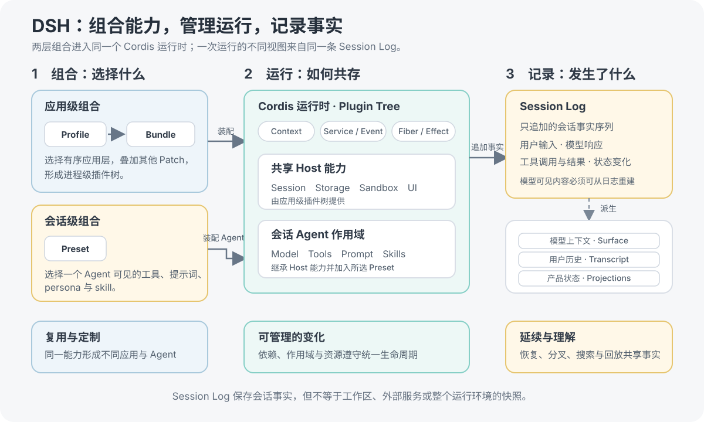
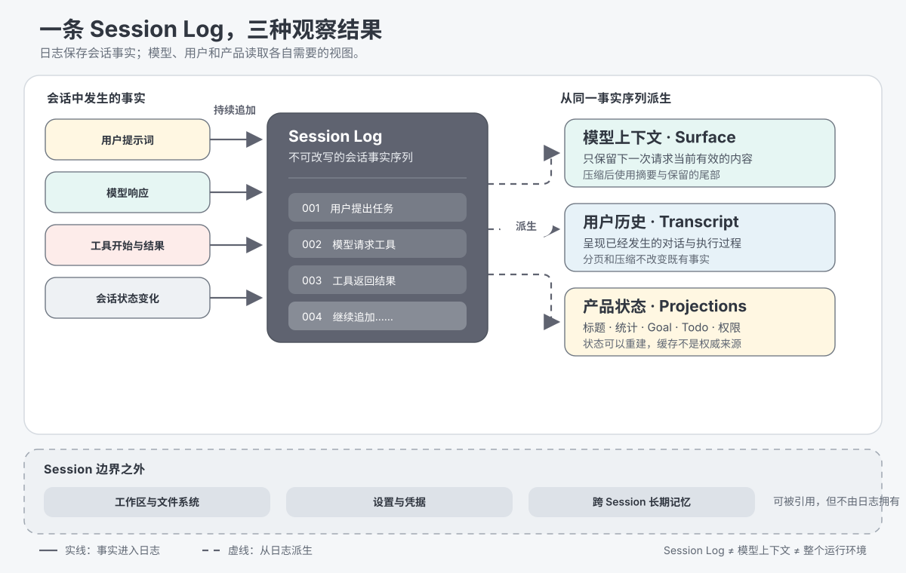

# DeepSeek Harness：把 Harness 做成可组合、可追溯的运行时

## 概述

DeepSeek Harness（DSH）最值得研究的，不是 developer preview 阶段随时可能变化的目录和接口，而是它如何定义 Harness：Harness 不只是调用模型和转发工具结果的集成代码，而是一套负责能力组合、运行生命周期、会话状态和产品形态的独立运行时。[官方发布页](https://www.deepseek.com/harness/en/)用三句话概括它：一切皆插件、每次运行都可追溯、同一套基础设施支持多种运行模式。Cordis、Plugin / Bundle / Profile / Preset 和 Session Log 正好构成了这套思路的三个支点。

## 目录

- [这次发布带来了什么](#what-the-release-adds)
- [Cordis：让插件化成为运行时能力](#cordis-runtime)
- [一切皆插件：从能力到应用与 Agent](#everything-is-a-plugin)
- [Session Log：让一次运行可以重建](#session-log)
- [如何理解 DSH 的价值](#why-dsh-matters)
- [延伸阅读](#further-exploration)

-----

## 这次发布带来了什么

DSH 的发布首先意味着 DeepSeek 把 Harness 从具体 Agent 产品中抽离出来，作为一个可独立使用和扩展的开源运行时。它带来的“新”，并不是插件系统、依赖注入或事件日志本身，而是把通常固定在产品内部的能力放进同一套组合模型。

| 新能力 | 直接收益 |
|---|---|
| 整套 Harness 可以组合 | 模型、工具、skill、会话、沙箱、存储、循环、调度和 UI 都能独立选择、替换或扩展，开发者不必为一项能力分叉整个项目。 |
| 应用与 Agent 分层组合 | 同一套 Host 基础设施可以形成不同应用入口；同一个应用又可以为不同会话装配不同的 Agent 能力。复用、定制和对照实验不再互相冲突。 |
| 一套运行时支持多种形态 | Web、一次性任务、SDK 或自动化入口可以共享底层能力，而不是各自维护一套 Agent 栈。 |
| 运行过程成为持久事实 | 调试、审计、恢复、分叉、搜索和回放可以围绕同一条事件流进行，而不必从零散日志猜测当时发生了什么。 |

这些能力共同改变了 Harness 的定位：它不再只是模型调用前后的工程代码，而是决定一个 Agent 拥有什么能力、如何运行，以及运行结果能否被理解和延续的产品基础设施。

-----

## Cordis：让插件化成为运行时能力

把代码拆成插件并不困难，困难的是插件进入运行时以后如何发现依赖、限制可见范围，并在加载、替换或卸载时正确释放资源。DSH 使用 [Cordis](https://arxiv.org/abs/2608.25512) 解决这些问题。

- **Context 管理空间关系。** 插件通过稳定的服务名寻找能力；不同 Context 可以继承、隔离或覆盖服务，因此同一进程能够容纳不同作用域的组合。
- **Service 与 Event 管理协作。** Service 适合直接调用一项能力，Event 适合观察、拦截或扩展一次行为。插件依赖抽象能力，而不必绑定具体实现。
- **Fiber 与 Effect 管理时间关系。** 一次插件挂载形成一个有生命周期的实例；它注册的服务、监听器和其他资源随实例统一撤销，依赖恢复后也可以重新激活。

因此，Cordis 的作用不是“提供一个插件列表”，而是让插件能够安全地共存、消失、替换和重新组合。这是 DSH 能把 Agent Loop、模型适配器、工具、会话和 UI 都做成插件的前提。

“一切皆插件”描述的是进入 Agent 产品的能力，并不表示启动系统本身可以无限递归地插件化。CLI、配置加载和进程启动仍然构成让第一批插件开始运行的最小底座。

-----

## 一切皆插件：从能力到应用与 Agent

DSH 用四个层次把“能力可以替换”推进到“完整产品可以组合”。它们不是四种大小不同的插件，而是承担不同职责的对象。

| 概念 | 回答的问题 |
|---|---|
| **Plugin** | 具体能力和行为由谁提供？它是进入 Cordis 运行时的基本单元。 |
| **Bundle** | 哪组插件配置需要一起复用和分发？它提供可安装、可继续覆盖的 Patch 层。 |
| **Profile** | 这次启动要形成哪一种应用？它选择有序 Bundle，并叠加 Profile、Home 或本次启动的 Patch。 |
| **Preset** | 这个会话中的 Agent 应该看到哪些能力？在支持 Preset 的运行时中，它组合工具、persona、提示词和 skill 等会话级贡献。 |

这里实际存在两条组合轴。应用轴由 Profile、Bundle 和其他 Patch 形成进程级插件树；会话轴由运行中的 Host 能力与所选 Preset 形成具体 Agent。Preset 不启动进程，也不保存对话；Profile 则不等于某个正在运行的 Agent。

这种分离让基础设施和 Agent 个性各自演进：应用可以共享会话、存储、权限与 UI 等 Host 能力，不同 Agent 只替换自己需要的模型可见能力。Bundle 是常见的配置分发方式，但并非所有插件配置都必须来自 Bundle；Profile、Home、命令行或产品启动器也可以提供 Patch。

-----

## Session Log：让一次运行可以重建

DSH 的 Session Log 不是普通聊天记录，而是一条只追加的类型化会话事实序列。用户输入、模型响应、工具调用与结果，以及需要延续的会话状态，都以事件进入这条序列。它遵守一个关键原则：模型看到的内容必须能够从 Session Log 重建。

同一条日志可以派生三种不同视图：下一次模型请求使用的上下文、用户查看的完整执行历史，以及标题、Goal、Todo 等产品状态。压缩可以改变模型下一次看到的内容，但不会把已经发生的事实从日志中抹掉。

这使恢复、分叉、搜索和回放不再是互不相干的附加功能，而是对同一事实流的不同操作。它也为调试、审计和 Agent 评测提供了比终端输出更完整的依据。

Session Log 仍有明确边界：它不是整个运行环境的快照。工作区文件、外部服务、设置与凭据，以及插件代码本身可以被会话引用，但不由这条日志完整保存。它保证会话事实可重建，不保证外部世界自动回到历史状态。

-----

## 如何理解 DSH 的价值

把这几项设计放在一起，DSH 表达了三个清晰判断：Agent 能力不必固化在 Harness 内核中；应用运行时与每个会话的 Agent 组合应该分开；执行历史应该成为可重建的系统事实，而不是一次性聊天输出。

Cordis 回答插件如何协作并遵守生命周期，Plugin / Bundle / Profile / Preset 回答应用与 Agent 由什么组成，Session Log 回答运行中发生了什么以及后续如何继续。三者组合起来，DSH 才不只是另一个 Coding Agent，而是一种构建 Agent 产品的方法。

当前项目仍处于 developer preview，具体 API、包结构和组合方式都会继续变化。因此，现阶段更值得追踪的是这些设计判断能否经受不同产品形态、第三方插件和长期会话的检验，而不是把某一版实现细节当成稳定规范。

-----

## 延伸阅读

- [DeepSeek Harness 官方发布页](https://www.deepseek.com/harness/en/) — 官方对插件化、可追溯运行和多种模式的概括。
- [仓库架构文档](../docs/architecture.zh.md) — 当前实现所遵守的组合、事件、Session Log 与扩展规则。
- [Cordis 入门](../docs/cordis-primer.zh.md) — Context、Service、Event 与可逆 Effect 的基本语义。
- [DeepSeek Harness Web Profile 运行时](web-profile-runtime.md) — 沿启动与会话路径展开的实现分析。
- [DSH Desktop 与原生 `dsh web` 差异分析](dsh-desktop-vs-web.md) — 一个下游产品如何复用并扩展这套组合模型。

-----

## 开发备注

无。
