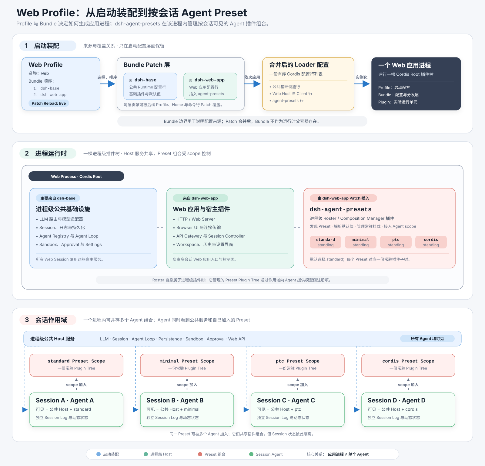

# DeepSeek Harness Web Profile 运行时

## 概述

随附的 `web` profile 为一个 `dsh` 进程选择完整的浏览器应用组合。它的两个组合包构建进程级 Cordis 插件树，而 `dsh-agent-presets` 在已启动的 Web 运行时内为每个 agent（智能体）增加独立的会话级组装步骤。Web 组合包声明 preset roster 在何处进入进程树，但该 roster 服务拥有 preset 发现与 standing mount，Session Controller 则拥有每个 Web 会话的选择。会话持久化仍是基础运行时能力：preset 标识有助于重建 agent 的当前组合，但 preset 机制不负责持久化会话内容。

## 目录

- [明确区分三个层次](#keep-the-three-layers-separate)
- [沿启动路径阅读](#follow-the-boot-path)
- [理解组合后的运行时](#read-the-composed-runtime)
- [跟踪一个 Web 会话](#follow-one-web-session)
- [区分各种重载生命周期](#distinguish-the-reload-lifecycles)
- [检查本地组合](#inspect-a-local-composition)
- [按顺序阅读源码](#read-the-source-in-order)
- [延伸阅读](#further-exploration)
- [开发备注](#dev-note)

-----

<a id="keep-the-three-layers-separate"></a>
## 明确区分三个层次

这三个层次回答不同的问题。Profile 与 Bundle/Patch 是启动期组合概念；Agent Preset 是已启动 Web 运行时内部的会话级 agent 组合概念。

| 层次 | 回答的问题 | Web 实现 | 生命周期与所有者 |
|---|---|---|---|
| Profile | 这个 `dsh` 进程启动哪种应用组合？ | `web` 依次列出 `@deepseek-ai/dsh-base` 与 `@deepseek-ai/dsh-web-app`，并选择 `patchReload: live`。 | CLI（命令行界面）与 `dsh-app-boot` 解析 profile 并启动进程。 |
| Bundle/Patch | 哪些 Cordis 配置项构成进程插件树？ | `dsh-base` 插入共享运行时条目。`dsh-web-app` 覆盖 Web 配置值，插入 Host 与浏览器条目，禁用基础层中属于每个 agent 的条目，并插入 `dsh-agent-presets`。 | 每个组合包拥有自己的 patch 文档；每个被插入的插件包拥有自己的运行时行为。 |
| Agent Preset | 一个 agent 可以看到哪些工具、提示词片段、skill（技能）和其他作用域化贡献？ | `standard`、`minimal`、`ptc` 与 `cordis` 是随附的 `agent.cordis.yml` 组合；Web 会话解析一个 preset，并把自己的 agent 作用域连接到该 preset 的 standing mount。 | `dsh-agent-presets` 拥有发现与挂载；Session Controller 选择并记录会话的 preset。 |

并非每个插件条目都由某个组合包拥有。组合包是 patch 层的分发与来源机制；profile、home 和命令行 patch 层也可以直接插入条目。



“Web 组合包挂载 `dsh-agent-presets`”是对一项配置事实的简写：[`packages/bundle/web-app/cordis.patch.yml`](../packages/bundle/web-app/cordis.patch.yml) 把 `agent-presets` 条目插入进程树。[`packages/bundle/web-app/package.json`](../packages/bundle/web-app/package.json) 还把该包列为依赖，使 Loader 能够解析这条配置。这并不表示组合包拥有 preset 状态。激活后，[`AgentPresets`](../packages/preset/agent-presets/src/index.ts) 服务拥有 roster、文件系统根目录、standing generation，以及 agent 与 preset 之间的作用域绑定。

因此，Profile 中并不包含某个运行中的 agent。它为一个进程选择应用插件树。Web Host 随后响应会话操作，动态创建或恢复 agent 实例，并在发布每个实例之前完成组装。

-----

<a id="follow-the-boot-path"></a>
## 沿启动路径阅读

Web 启动路径分别处理 launcher 参数、配置组合与插件激活。这种分离说明了应用参数为何不是另一个 patch 层，也说明了 preset 为何必须等到进程树激活后才存在。

1. [`parseDshArgs()`](../apps/cli/src/args.ts) 把 `dsh web` 映射到 `web` profile。它只消费 `--profile`、`--patch` 与 dump 参数等由 launcher 拥有的参数，其余参数属于所选应用。
2. [`bin.ts`](../apps/cli/src/bin.ts) 捕获分层的启动环境，并使用 profile 名、patch 文件和剩余参数调用 `runProfile()`。
3. [`prepareProfile()`](../apps/cli/src/profile-boot.ts) 调用 [`loadProfile()`](../packages/boot/app-boot/src/profile.ts)。首次使用时，随附模板会生成 `$DSH_HOME/profiles/web/package.json`、`cordis.patch.yml` 与 `pnpm-workspace.yaml`。launcher 会把该 profile 的 `cordis.yml` 重写为空条目列表，因为所有实际条目都来自 patch 层。
4. `loadProfile()` 读取 `dsh.profile.bundles`，解析每个包，跟随其 `dsh.bundle.patch` 声明，并解析 patch 文档。对于 Web，有序组合包层先是 `dsh-base`，然后是 `dsh-web-app`。
5. [`runProfile()`](../apps/cli/src/profile-boot.ts) 准备 profile 已安装插件使用的模块 fallback，组合所有层，并在任何配置项激活前提供不可变的启动环境与 `cmdlineArgs`。
6. [`boot()`](../packages/boot/app-boot/src/index.ts) 创建根 Cordis `Context`，安装 Loader，在空 `cordis.yml` 上挂载一个根 Include，等待 Loader 树完全结算，并拒绝任何加载失败或未激活的已启用条目。

正常启动按以下顺序应用各层；后面的层可以替换前面条目的完整 `config`，也可以插入新条目：

| 顺序 | 来源 | 用途 |
|---:|---|---|
| 1 | `@deepseek-ai/dsh-base/cordis.patch.yml` | 共享模型、会话、持久化、注册表、工具、沙箱、审批、设置及其他 Host 基础设施 |
| 2 | `@deepseek-ai/dsh-web-app/cordis.patch.yml` | Web 专用覆盖、Host/API/浏览器条目与 preset roster |
| 3 | `$DSH_HOME/profiles/web/cordis.patch.yml` | 用户为 Web profile 提供的覆盖 |
| 4 | `$DSH_HOME/cordis.patch.yml` | 所有 profile 共享的本机覆盖 |
| 5 | 重复提供的 `--patch <path>` 文件 | 按命令行顺序应用的本次调用 overlay |
| 6 | launcher 遥测 opt-out | 当 `DSH_TELEMETRY_DISABLED` 非空且遥测条目存在时，最后应用的禁用 patch |

Web 参数 `--host`、`--port`、`--trusted-host` 与 `--no-open` 不会变成 patch 文件。launcher 将剩余参数公开为 `ctx.cmdlineArgs`；[`web-startup`](../packages/bundle/web-app/src/startup.ts) 解析这些参数并提供 `ctx.webStartup`。`webserver` 与 `web-runtime` 条目上的惰性表达式会先注入该服务，再读取本次调用解析出的值。

-----

<a id="read-the-composed-runtime"></a>
## 理解组合后的运行时

启动完成后，Profile 与 Bundle 是配置来源标签，而不是运行时容器。Cordis 运行的是所有 patch 生成的最终插件树。最有助于理解运行时的划分是进程 Host 平面、浏览器 Client 平面，以及每个会话各自选择的 agent 平面。

### 进程 Host 平面

`dsh-base` 提供模型适配器、agent 与会话注册表、agent loop（智能体循环）、JSONL 持久化、投影、沙箱与审批策略、设置、凭据和 host 级注册表等共享服务。Web patch 把必须服务多个会话的共享服务留在这一平面，然后插入 Web server、API Gateway 消费方、Session Controller、静态前端 Host、浏览器插件扫描器及其他 Web 专用服务。

[`web-startup`](../packages/bundle/web-app/src/startup.ts) 提供已解析的调用参数。[`web-runtime`](../packages/bundle/web-app/src/index.ts) 等待 server bind，推导 trusted-host 快照，挂载静态前端服务，注册 Web surface prompt 与 `DSH_WEB_URL`，并且只在 Loader 树完全结算后打印或打开已认证 URL。

### 浏览器 Client 平面

所在包声明了 client plugin 的条目会被扫描进 `window.__DSH_BOOT__`。浏览器根据该 roster 创建自己的 Cordis client 运行时。`connection` 拥有经过认证的传输和 `/api` 访问，`api-remotes` 安装生成的 Typert client，UI 条目则贡献会话、聊天、设置、审批、preset、工具及其他视图。这些浏览器插件不会成为每个会话的 agent 插件。

### 每个会话的 Agent 平面

基础组合包为创建 bare agent 的应用提供一套进程级默认 agent 工具与提示词组合。Web patch 明确禁用这些属于每个 agent 的条目，改为插入 `dsh-agent-presets`。跨会话使用的 Host 服务保留在进程级；面向模型的工具、提示词片段、本地 skill 发现和委派控制进入 preset 组合，使作用域化注册表可以为单个 agent 解析它们。

条目的放置规则由行为决定。任何在会话存在前就必须使用，或由 Host 读取方跨会话共享的服务，都属于 Host 平面。会改变某个 agent 模型所见内容的贡献属于 Agent Preset。preset 服务必须位于 `isolate` realm 之后；preset 挂载会拒绝泄漏进程级服务的条目。

-----

<a id="follow-one-web-session"></a>
## 跟踪一个 Web 会话

Session Controller 把浏览器会话操作连接到 agent 创建和 preset 组合。关键路径是 [`ApiSessionAgentController.composeAgent()`](../packages/api/session-controller/src/agent.ts)。

### 创建

对于新会话，controller 请求 `ctx.agentPresets` 解析指定 preset，未指定时解析其已配置默认值。随附 Web 条目设置 `default: standard`；设置服务可以修改后续会话使用的默认值。controller 把解析后的 id 放入会话创建元数据，并向 `ctx.agents.create()` 传入 agent `setup` 回调。

agent-loop factory 创建尚未发布的会话与 agent 作用域，然后等待该回调。回调会安装会话局部的模型选择，并调用 `presets.mount(agentCtx, resolvedId)`。factory 只在 setup 成功后发布会话与 agent。因此，缺失、损坏或未激活的 preset 组合会回滚创建，而不会暴露只完成部分组装的 agent。

### 恢复

对于已持久化会话，controller 读取 `agentPreset` 会话投影，在当前部署中解析该 preset，并向 `ctx.agents.resume()` 传入相同的 setup 路径。投影以创建 header 的 `agentPreset` 为初始值，并应用任何后续的 `agent-preset/selected` 事件。恢复操作围绕持久日志重新创建兼容的实时 agent；它不会恢复旧的内存插件树，也不会把完整 preset 源码嵌入日志。

### Standing mount 与隔离

`AgentPresets.mount()` 解析可用 preset 并调用 `ensureStanding()`。某个 preset 第一次使用时会创建 standing 作用域组合；并发的首次使用方共享同一个 single-flight mount。随后，每个 agent 都把自己的作用域父级绑定到该 standing 作用域。因此，使用同一 preset generation 的 agent 可以共享插件实例，同时作用域化注册仍为当前寻址的 agent 解析，不会进入相邻 preset。

如果 `agent.cordis.yml` 发生变化，下一个使用该 preset 的会话会创建新的 standing generation。现有会话留在自己已经加入的确切 generation 上。subagent 使用 `composeFrom()` 加入父 agent 的现有 generation，而不是重新解析 preset id。

### Session Log 的职责

会话历史能够持久保存，是因为基础运行时挂载了会话日志与持久化，而不是因为 Web 挂载了 Agent Preset。preset 机制只记录重建组合所需的标识：创建 header 记录初始 preset；空会话切换 preset 时，则在新组合提交后追加 `agent-preset/selected`。会话的第一个轮次开始后便不能切换，因为之前的日志可能包含新组合无法产生的工具调用。

因此，重建需要同时满足三项条件：持久会话日志、能够加载每种已记录事件类型的当前运行时，以及能以日志所记录 id 组装 agent 的当前 preset。日志保存会话事实与所选 preset 标识，但不保存 preset 的历史代码、依赖版本或完整 `agent.cordis.yml` 内容。

-----

<a id="distinguish-the-reload-lifecycles"></a>
## 区分各种重载生命周期

Web 同时包含几种相互独立的变更机制。把它们全部称为“实时重载”，会掩盖哪些运行时对象会被替换，以及哪些会话会保留当前组合。

| 变化的输入 | 检测与效果 | 现有会话 |
|---|---|---|
| Profile `cordis.patch.yml` | profile watcher 重新解析两份用户 patch 文件，并以其下方对启动时组合包层的新副本和其上方的冻结命令行 overlay，事务式更新根 Include。 | 进程树条目可按 Cordis 生命周期更新；这不是 preset generation 切换。 |
| Home `$DSH_HOME/cordis.patch.yml` | 第二个 profile watcher 执行相同的根树重组。 | 与 profile patch 的进程树行为相同。 |
| 组合包 patch 或插件源码 | profile patch watcher 不监视这些文件。源码和构建产物工作流有各自的重新构建或重启要求。 | `patchReload: live` 不会自动迁移 preset 或进程树。 |
| 默认 preset 设置 | `AgentPresets.defaultId` 每次解析时都读取设置值。 | 现有会话保留已选 preset；后续会话使用新的默认值。 |
| Preset `agent.cordis.yml` | 发现过程重新读取根目录；会话下次请求该 preset 时，`ensureStanding()` 比较组合文件 stamp。stamp 变化会启动新的 standing generation。 | 现有会话保留旧 generation；后续会话加入新 generation。 |
| 空会话选择 preset | roster 挂载目标 generation，重新绑定该 agent 作用域，发出 `tools/change`，然后追加 `agent-preset/selected`。 | 仅被选择的空会话发生变化；已开始的会话拒绝此操作。 |

Web profile 的 `patchReload: live` 只应用于 profile 级与 home 级用户 patch 文件。它与浏览器 client HMR 及 preset 组合文件的 generation 行为相互独立。

-----

<a id="inspect-a-local-composition"></a>
## 检查本地组合

在跟踪单个插件之前，请先使用 dump 命令。它们在同一个空根文件上运行与启动相同的 patch 算法，保留未求值的 `!!js` 表达式，并标注每个条目的来源层。

```sh
dsh web --dump-default-config
dsh web --dump-config
dsh web --patch ./extra.yml --dump-config
```

`--dump-default-config` 只包含组合包层。`--dump-config` 还会添加 profile patch、home patch 与命令行 patch 文件。dump 会初始化缺失的 profile，但不会启动插件、准备运行时模块 fallback、运行 `web-startup`，也不会应用仅属于 launcher 的遥测 opt-out。由于没有应用插件能够解释 Web 应用参数，dump 会拒绝包含这些参数的调用。

如果某个条目的行为不符合预期，请先在 dump 中找到它的 `# ==` 来源注释，再根据条目 id 定位贡献该条目的 patch，最后打开被插入插件包的源码。这样就能分开回答“哪个层把条目放进这里？”与“哪个插件拥有这项行为？”。

-----

<a id="read-the-source-in-order"></a>
## 按顺序阅读源码

以下路线从应用选择逐步深入运行时行为，无需完整通读任一组合包 patch。

| 顺序 | 文件 | 核对内容 |
|---:|---|---|
| 1 | [`apps/cli/src/args.ts`](../apps/cli/src/args.ts) | `web` 别名、launcher 参数与透传的应用参数 |
| 2 | [`apps/cli/src/bin.ts`](../apps/cli/src/bin.ts) | 分派到 profile 启动或不启动插件的配置 dump |
| 3 | [`packages/boot/app-boot/src/profile.ts`](../packages/boot/app-boot/src/profile.ts) | `PROFILE_TEMPLATES`、首次使用初始化、组合包解析与 patch 解析 |
| 4 | [`apps/cli/src/profile-boot.ts`](../apps/cli/src/profile-boot.ts) | 空根准备、确切层次顺序、Host 服务、启动与实时 watcher |
| 5 | [`packages/boot/app-boot/src/index.ts`](../packages/boot/app-boot/src/index.ts) | 根 Include 挂载、Loader 结算、激活审计与 patch 监视 |
| 6 | [`packages/bundle/base/cordis.patch.yml`](../packages/bundle/base/cordis.patch.yml) | Web overlay 之前的共享进程条目 |
| 7 | [`packages/bundle/web-app/cordis.patch.yml`](../packages/bundle/web-app/cordis.patch.yml) | Web 覆盖与插入、被禁用的每 agent 条目，以及 `agent-presets` 条目 |
| 8 | [`packages/bundle/web-app/src/startup.ts`](../packages/bundle/web-app/src/startup.ts) 与 [`src/index.ts`](../packages/bundle/web-app/src/index.ts) | Web 参数服务与 server bind 后的运行时 glue |
| 9 | [`packages/api/session-controller/src/agent.ts`](../packages/api/session-controller/src/agent.ts) | 创建和恢复会话时的 preset 解析 |
| 10 | [`packages/core/agent/src/index.ts`](../packages/core/agent/src/index.ts) 与 [`packages/core/agent-loop/src/index.ts`](../packages/core/agent-loop/src/index.ts) | agent 发布前的 setup 与回滚保证 |
| 11 | [`packages/preset/agent-presets/src/index.ts`](../packages/preset/agent-presets/src/index.ts)、[`mount.ts`](../packages/preset/agent-presets/src/mount.ts) 与 [`session.ts`](../packages/preset/agent-presets/src/session.ts) | roster 所有权、standing mount、作用域绑定、挂载审计与持久 preset 投影 |
| 12 | [`packages/preset/agent-presets/presets/`](../packages/preset/agent-presets/presets/) | 随附的 `standard`、`minimal`、`ptc` 与 `cordis` agent 组合 |

-----

<a id="further-exploration"></a>
## 延伸阅读

以下页面补充上述路径所依赖的框架概念和包级细节。

- [架构](../docs/architecture.zh.md) — 仓库级 Profile、Bundle、应用启动和会话日志规则。
- [Cordis 入门](../docs/cordis-primer.zh.md) — Loader 条目、服务、注入、作用域、副作用与 patch 语义。
- [app-boot](../packages/boot/app-boot/README.zh.md#profiles) — profile manifest、模块 fallback、组合、dump 与 watcher 约定。
- [Web app 组合包](../packages/bundle/web-app/README.zh.md) — 用户行为与该包拥有的 Web 实现细节。
- [Agent presets](../packages/preset/agent-presets/README.zh.md) — 发现、创作、standing generation、切换与失败行为。
- [Scope 子系统](../docs/subsystems/scope.zh.md) — agent 加入 preset 时使用的作用域 key 与父级链。
- [Session 子系统](../docs/subsystems/session.zh.md) — 持久事件存储、回放、投影与持久化。
- [DSH Desktop 与原生 `dsh web` 差异分析](dsh-desktop-vs-web.md) — 对比两者的 Profile、Bundle/Patch、Plugin Tree、Agent Preset 与生命周期。

-----

<a id="dev-note"></a>
## 开发备注

无。
